## Part 1. Установка ОС.
- Результат выполнения команды  \
`cat /etc/issue`

    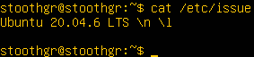

## Part 2. Создание пользователя

- Создаем пользователя d01_linux-1

    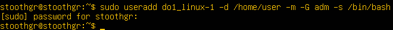

- Результат вывода команды \
`cat /etc/passwd`

    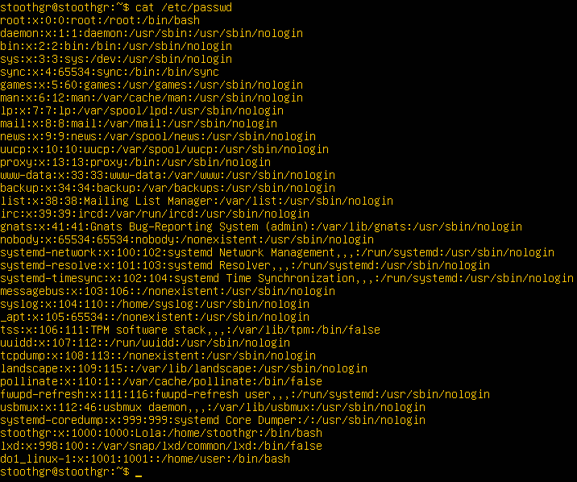

## Part 3. Настройка сети ОС

- Задаём название машины вида user-1.

    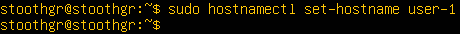

- Перегружаем (reboot) для принятия изменений:

    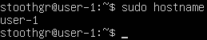

- Установливаем временную зону, соответствующую моему текущему местоположению

    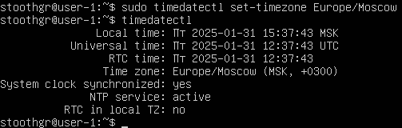

- Выведим названия сетевых интерфейсов с помощью консольной команды.

   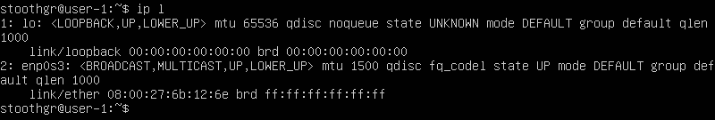
   
>Сетевой интерфейс lo, является специальным сетевым интерфейсом, который всегда присутствует на каждом компьютере или сервере. Он служит для локальной петли и используется для обмена данными с самим собой, без отправки данных во внешнюю сеть.

- Используя консольную команду, выводим ip адрес устройства, выданный нам DCHP - сервером.

    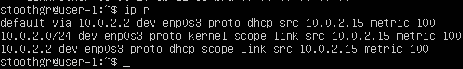

>На скриншоте видно, что DHCP выдал компьютеру ip адрес: 10.0.2.15

>DHCP — это протокол клиента или сервера, который автоматически предоставляет узел протокола IP с его IP-адресом и другие связанные сведения о конфигурации, такие как маска подсети и шлюз по умолчанию.

- Выводим на экран внешний ip-адрес шлюза (ip).

    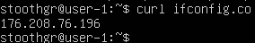

- И внутренний IP-адрес шлюза, он же ip-адрес по умолчанию (gw). Для выполения команды \ `route -n` (должен быть установлен пакет net-tool).

    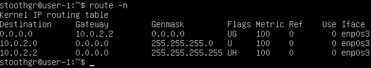

- Задаём статичные (заданные вручную, а не полученные от DHCP-сервера) настройки ip, gw, dns (используя публичные DNS-серверы, например 1.1.1.1 или 8.8.8.8).  
>Сначала находим в папке `/etc/netplan/`файл с сетевыми настройками имеющий расширение `.yaml`
>Для этого с помощью команды `sudo nano /etc/netplan/00-installer-config.yaml` открываем файл с настройками.  

    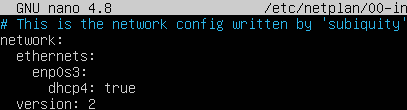  

- Задаем статичные (заданные вручную, а не полученные от DHCP-сервера) настройки ip, gw, dns (используй публичный DNS-серверы, например 1.1.1.1 или 8.8.8.8).
>Для этого с помощью команды sudo nano /etc/netplan/00-installer-config.yaml приводим файл к
слелующему виду:

    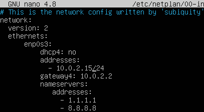

>Мы задали статический ip адрес 10.0.2.15

>Для применения изменений используем команду \ `sudo netplan apply`

- Далее перезагрузим виртуальную машину командой reboot и проверяем сохранились ли выставленные вручную настройки. Для этого воспользуемся командой \ `sudo cat /etc/netplan/00-installer-config.yaml`  

    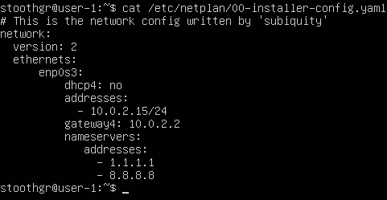

- Командой "ip a" выводим информацию о сети, убеждаемся что ip адрес системы соответствует заданному нами ранее статическому адресу: 10.0.2.11.  
    
    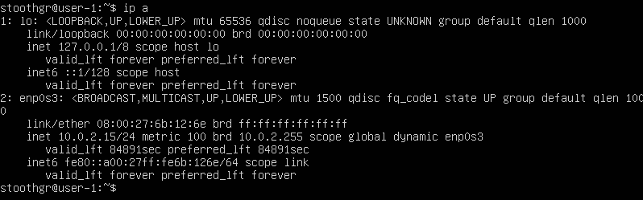   

- Пингуем удаленные хосты 1.1.1.1 и ya.ru В выводе команды видим фразу «0% packet loss».

    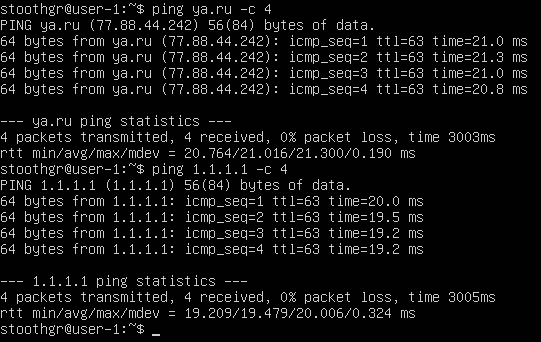

## Part 4. Обновление ОС

- Обновляем системные пакеты до последней на момент выполнения задания версии. Для этого последовательно выполняем команды \ `sudo apt update` и `sudo apt full-upgrade`

- После обновления системных пакетов, если ввести команду обновления повторно, сообщается что все пакеты обновлены.

    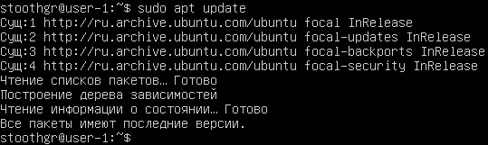

## Part 5. Использование команды **sudo**

- Разрешаем созданному в пункте Part 2 пользователю do1_linux-1 выполнять команду sudo.
> Для это вводим команду: `sudo usermod -a -G sudo do1_linux-1`.  
    И проверяем результат командой: `groups udo1_linux-1`
    И проверям:

    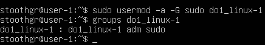

    выдача пользователю do1_linux-1 разрешения на использование команды `sudo`
    Так же, мы задаём пароль этому пользователю командой: `sudo passwd do1_linux-1`  
 Так как в Ubuntu и других дистрибутивах Linux нельзя создать пользователя без пароля, поскольку это представляет собой потенциальную угрозу безопасности. Ранее мы создали пользователя без задания пароля, но система автоматически блокирует вход под этим пользователем до тех пор, пока не будет установлен пароль.
  
- Меняем hostname ОС от имени пользователя, созданного в пункте [Part 2](#part-2-создание-пользователя) (используя sudo).  
  
Для этого используя команду `su` (switch user) переключаемся на пользователя user_do1.
После чего от имени пользователя user_do1 меняем hostname ОС на `newhost`.  

   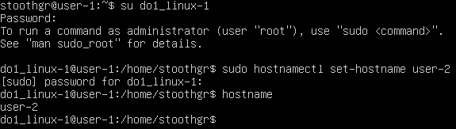

   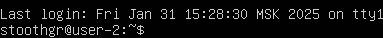

## Part 6. Установка и настройка службы времени

- Выводим время часового пояса, в котором сейчас находимся.

    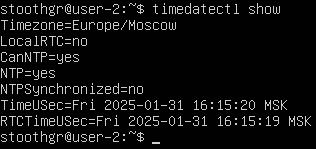

## Part 7. Установка и использование текстовых редакторов 

### 7.1 Сохранение и выход

- Установливаем текстовые редакторы **VIM**, **NANO**, **MCEDIT**, **JOE** используя команду \ `sudo apt install "название редактора"`

- Используя каждый из трех выбранных редакторов, создаем файл *test_X.txt*, где X — название редактора, в котором создан файл. Пишим свой никнейм, закрываем файл с сохранением изменений.
  
  #### 7.1.1 Vim
- Для создания файла с помощью vim мы пишем:
 `vim test_vim.txt`
 При входе в текстовый редактор можно сразу вводить текст, нажав:`insert` чтобы начать ввод.
    
> Нажимаем "ESC" для выхода в "командный режим", вводим ":", вводим "wq"
  
  #### 7.1.2 Nano 
- Аналогично, для создания файла с помощью nano, нам нужно прописать: 
 `nano test_nano.txt`, после чего, сразу можно вводить текст.  
    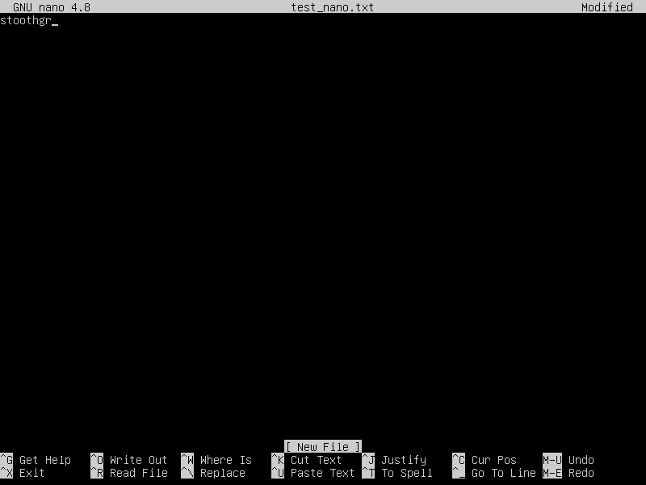
> Нажимем Ctrl+S - сохранить, Ctrl+X - выйти

  #### 7.1.3 Mcedit 
- Для создания файла с помощью mcedit, нам тоже нужно прописать: 
 `mcedit test_mcedit.txt`, после чего, сразу можно вводить текст.
    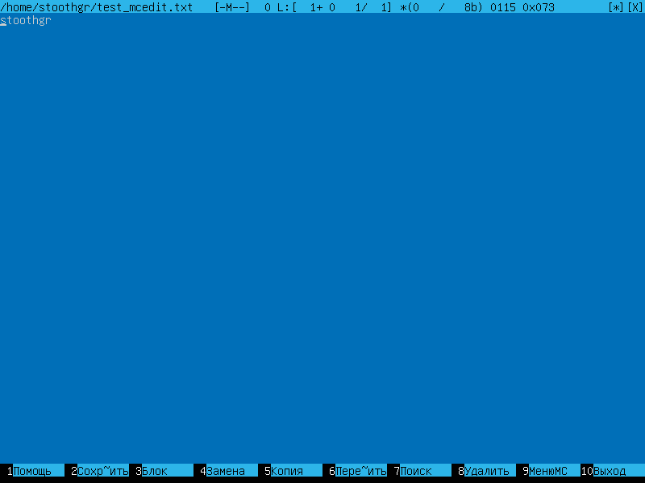
> Нажимаем F2- сохранить, переключаем курсор на Save - сохранить, нажмимаем F10 -выход

- Используя каждый из предыдущих редакторов, редактируем файл, заменив никнейм на строку «21 School 21», закрываем файл без сохранения.

### 7.2 Внесение изменений и выход без сохранения.
  
  #### 7.2.1 Vim

- Для изменения содержимого нужно нажать i или INSERT, чтобы перейти в режим редактирования. После изменения содержимого:

     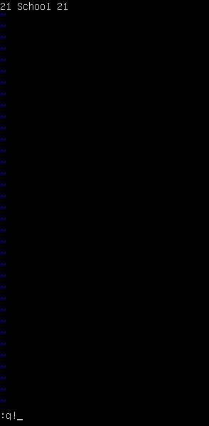
> Нажимаем "ESC" для выхода в "командный режим", вводим ":", вводим "q!"

   #### 7.2.2 Nano

- После изменения содержимого:

    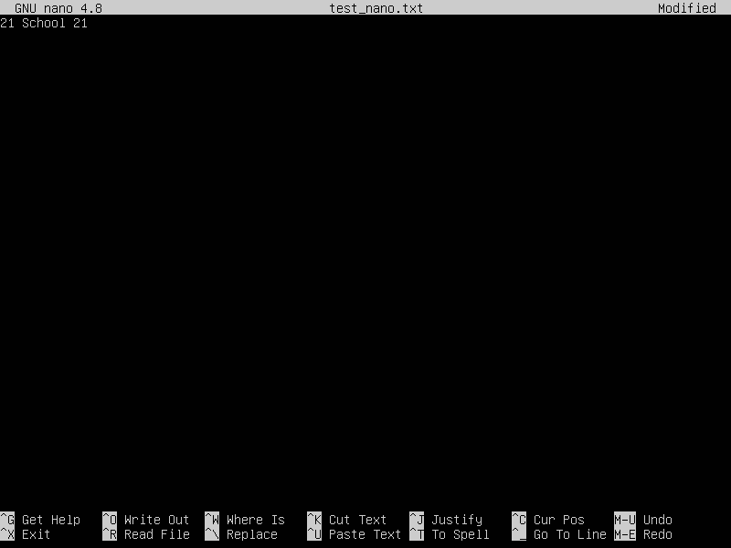
> Нажимем Ctrl+X - выйти, N - не сохранить
  
   #### 7.2.3 Mcedit

- После изменения содержимого:

    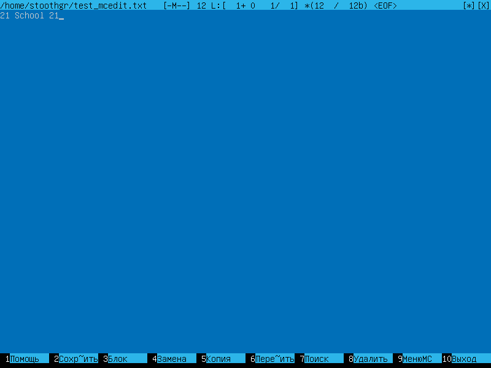

> Нажимаем F10 -выход, переключаем курсор на No - не сохранить.

### 7.3 Поиск слов

Используя каждый из трех выбранных редакторов, редактируем файл ещё раз (по аналогии с предыдущим пунктом), а затем осваиваем функции поиска по содержимому файла (слово) и замены слова на любое другое.
- Ниже в отчёте приведены скриншоты:
    - Из каждого редактора с результатами поиска слова.
    - Из каждого редактора с командами, введёнными для замены слова на другое.

   #### 7.3.1 Vim
   
- Для поиска в Vim необходимо перейти в командный режим через `Esc` и ввести `:s/<искомое_слово>`, поиск ведётся от курсора.   
   
     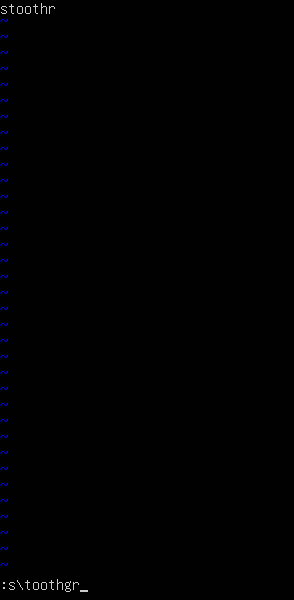

> Нажимаем "ESC" для выхода в "командный режим", вводим ":", вводим "s/искомое_слово"

   #### 7.3.2 Nano

- Для поиска в Nano используется сочетание клавиш: `Ctrl + W` и вводится искомое слово,после нажатие enter курсор перебрасывается на начало слова.   

     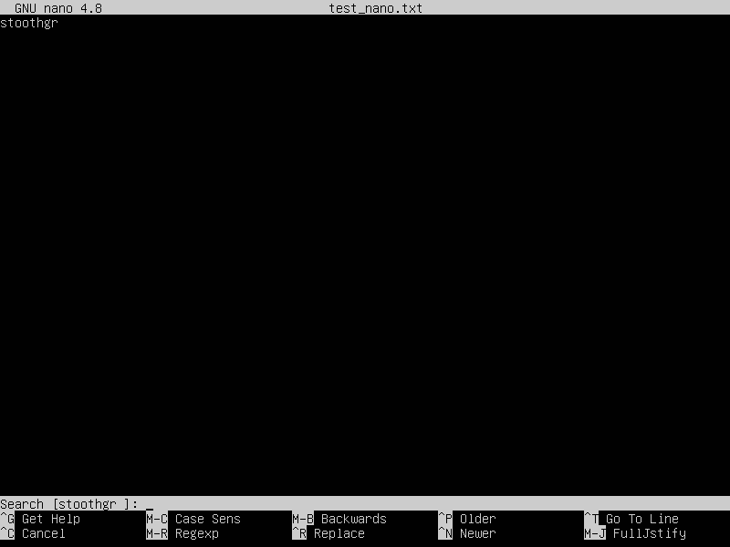

> Нажимаем Crtl+W - поиск начиная от курсора к концу файла
#### 7.3.3 Mcedit

- Для поиска в Mcedit необходимо нажать: `F7` и ввести искомое слово.   
      
     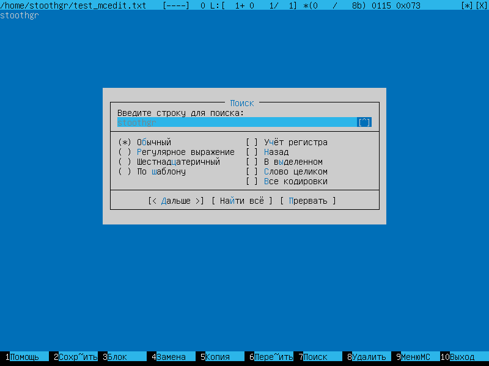

> Нажимаем F-8 - поиск.

### 7.4 Поиск c заменой слов

   #### 7.4.1 Vim

- Для замены всех появлений слова в файле нужно перейти в командный режим и ввести: `:%s/<искомое_слово>/<заменяемое_слово>/`
    
    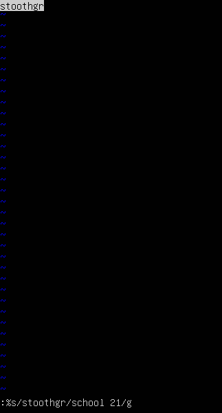

> Нажимаем "ESC" для выхода в "командный режим", вводим ":", вводим "%s/искомое_слово/новое_слово/g"

    #### 7.4.2 Nano

- Для замены слов используется комбинация: `Ctrl + \` и вводится искомое слово, нажимается: `Enter`, после чего вводится слово на которое мы заменяем найденное слово, нажимается: `Enter`.
    
    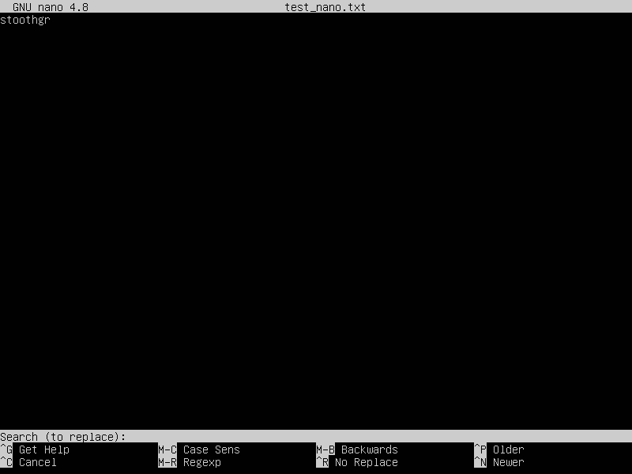

> Нажимаем Ctrl+\, введим строку, которую необходимо искать и нажмите клавишу Enter. Затем введим строку, на которую произвести замену и нажмите Enter
   
    #### 7.4.3 Mcedit
   
- Для замены необходимо нажать: `F4` и указать искомое слово и слово на которое мы заменяем найденное слово, 

    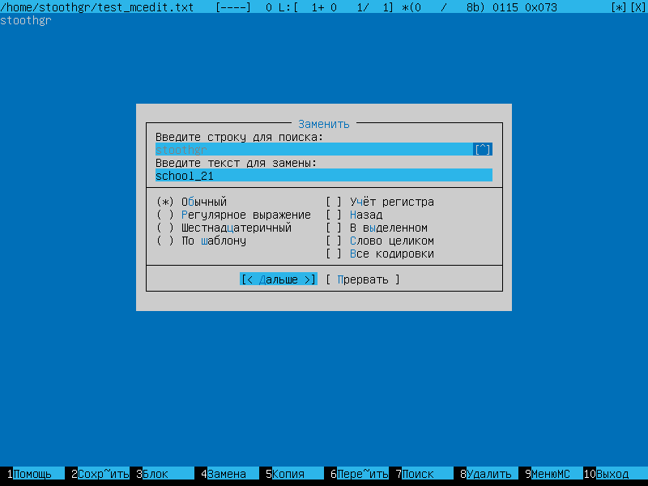

> Нажимаем F-4 - поиск и замена.

## Part 8. Установка и базовая настройка сервиса **SSHD**

- Установливаем службу SSHd.

`sudo apt install openssh-server`

- Добавляем автостарт службы при загрузке системы.

    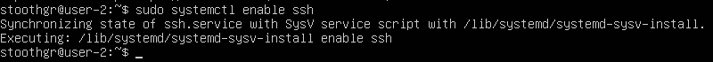

- Перенастроим службу SSHd на порт 2022.

    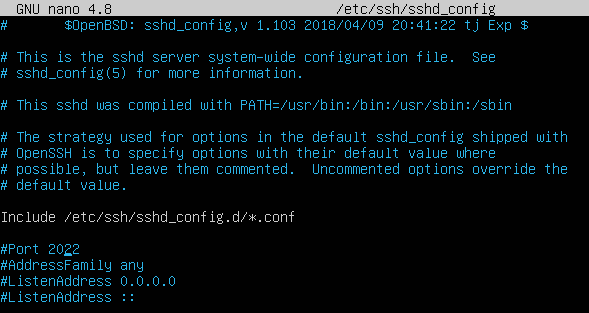

- Используем команду ps.

    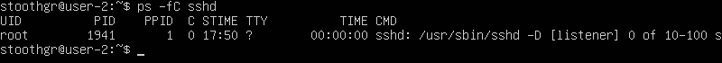

> Команда ps -fC sshd используется для отображения информации о процессах, связанных с SSHD, в более детализированном формате.

> -f: опция, которая указывает на вывод в полном формате/

> -C sshd: позволяет отобразить только процессы SSHD

- Перезагрузи систему (reboot).

- Вывод команды netstat -tan

    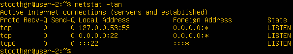

> -t: Этот ключ фильтрует вывод, чтобы отобразить только TCP-подключения. Он исключает из вывода UDP-подключения и другие типы сетевых соединений. "t" означает "TCP".

> -a: Этот ключ показывает все сетевые подключения, включая подключения в ожидании (LISTENING) и установленные (ESTABLISHED). Без этого ключа netstat не отобразит подключения в состоянии ожидания.

> -n: Этот ключ отключает обратное DNS-разрешение. Если его не использовать, netstat попытается выполнить обратное DNS-разрешение для IP-адресов, что может занять дополнительное время при выводе.

- Значение столбцов:

    > Proto - имя протокола;

    > Recv-Q - количество байтов, помещённых в буфер приёма;

    > Send-Q - количество байтов, помещённых в буфер отправки;

    > Local Address - IP-адрес локального компьютера и используемого номера порта;

    > Foreign Address - IP-адрес и номер порта удаленного компьютера, к которому подключен сокет;

    > State - Указывает состояние TCP-подключения;

    > 0.0.0.0 - это локальный адрес, зарезервированный серверами.

## Part 9. Установка и использование утилит **top**, **htop**

   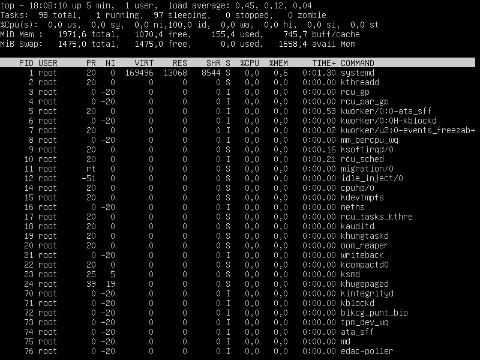

- По выводу команды top определяем:
  - uptime - 5;
  - количество авторизованных пользователей - 1 users;
  - средняя загрузка системы - 0.45 за одну минуту, 0.12 - за пять минут, 0.04 - за пятнацать минут;
  - общее количество процессов - 98;
  - загрузку cpu - 0,0 us
  - загрузку памяти - 155,4 использованно из 1971,6
  - pid процесса занимающего больше всего памяти - 1 (0,6%)
  - pid процесса, занимающего больше всего процессорного времени - 1 (00:01:30)
- Вывод команды htop:

    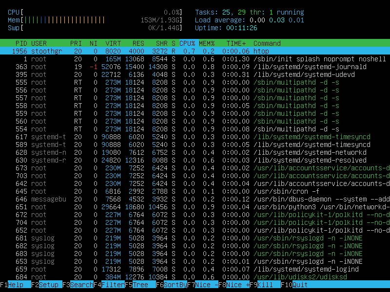

  - сортировка по PID:

  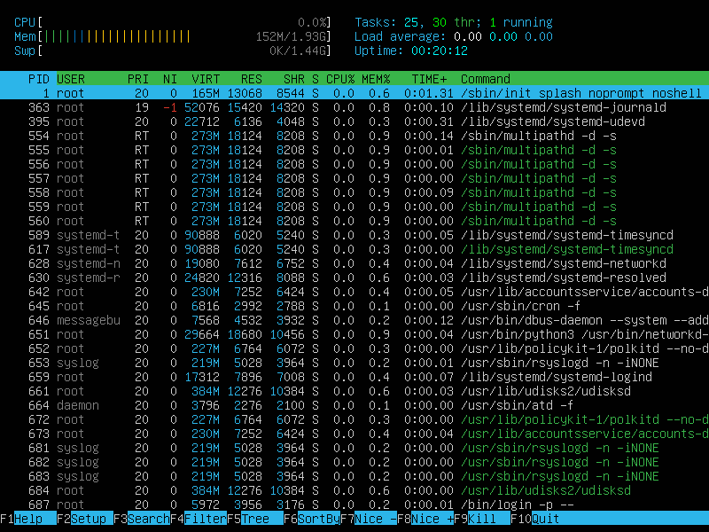

  - сортировка по PERCENT_CPU:

  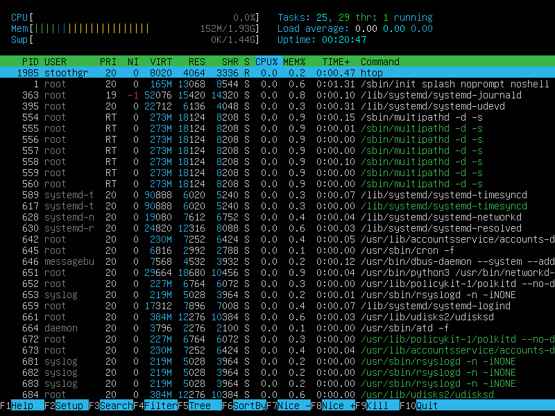

  - сортировка по PERCENT_MEM:

  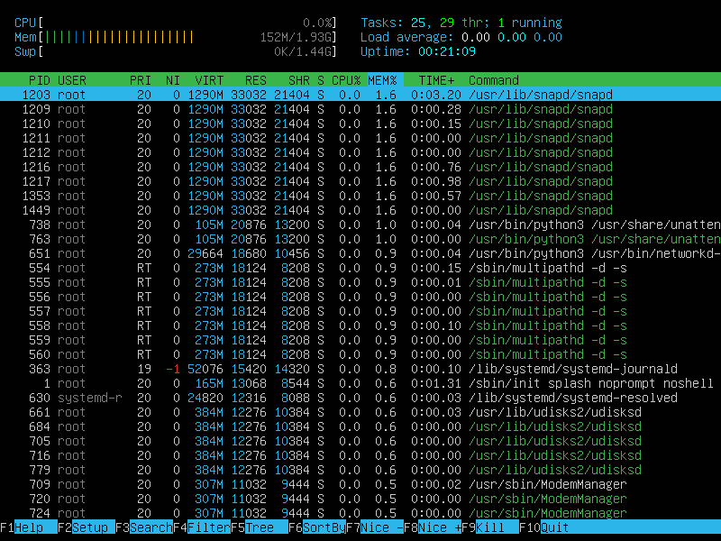

  - сортировка TIME;

  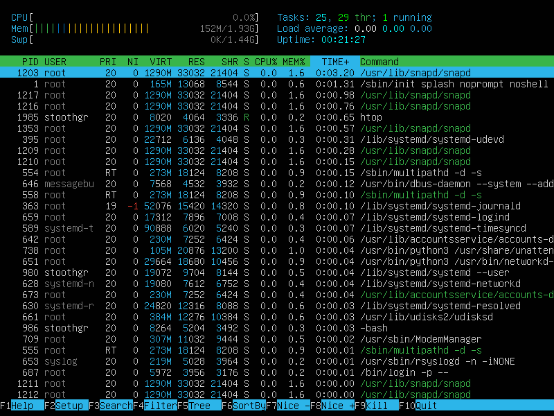

  - отфильтрованному для процесса sshd;

  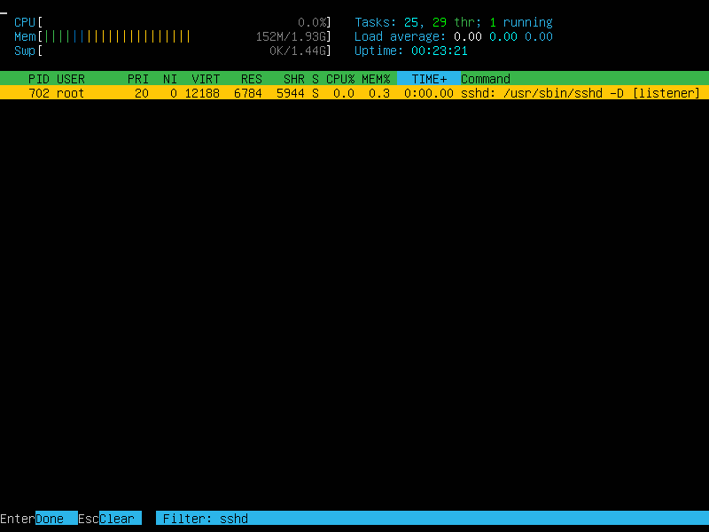

  - с процессом syslog, найденным, используя поиск;

  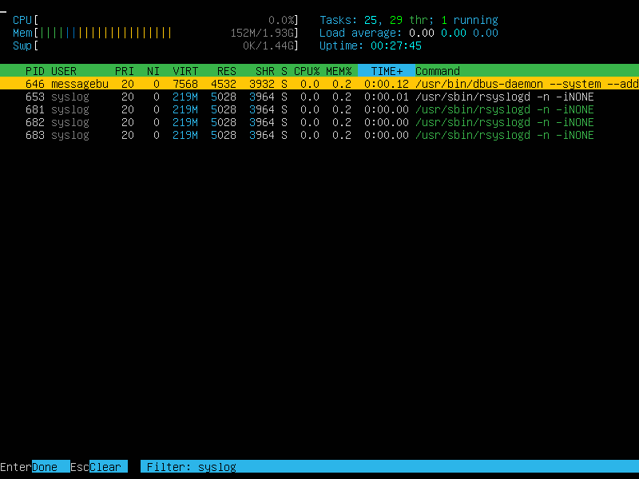

  - с добавленным выводом hostname, clock и uptime.

  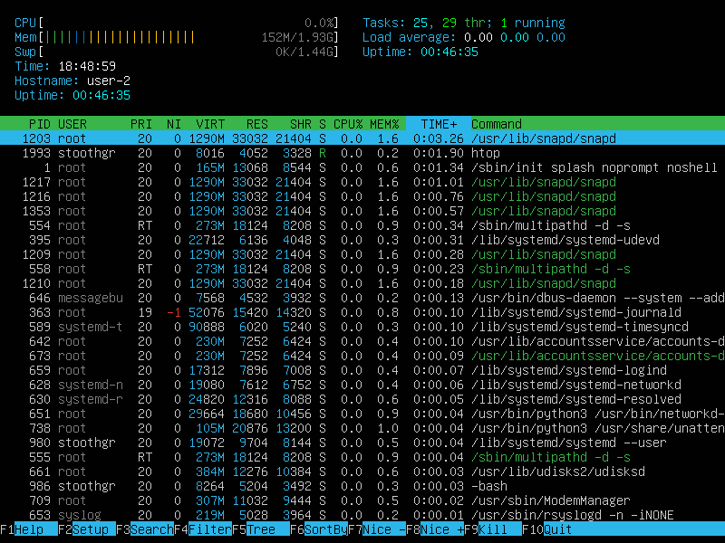

## Part 10. Использование утилиты fdisk.

- Вывод команды \ `sudo fdisk -l`.

    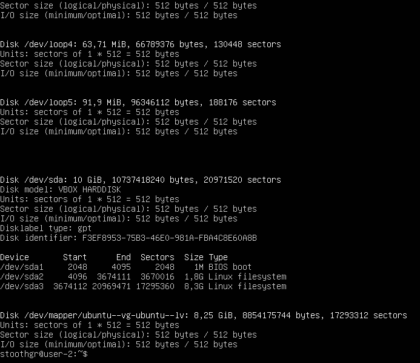

 > название жесткого диска /dev/sda;

 > его размер - 10 GiB;

 > количество секторов - 20971520 sectors;

 >размер swap - 1,5G;

## Part 11. Использование утилиты **df** 

- Команда df.

    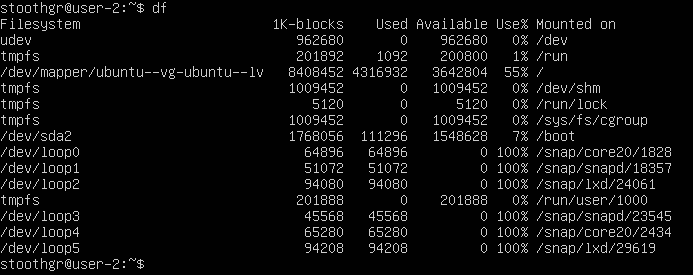

  - размер раздела -  8408452
  - размер занятого пространства - 4316932
  - размер свободного пространства - 3642768
  - процент использования - 55%
  - единица измерения - kB.

- Команду df -Th.

    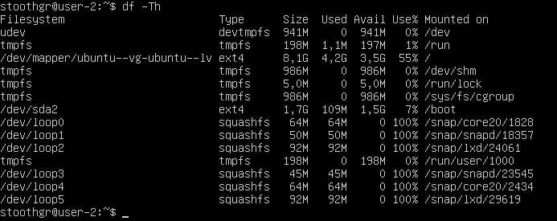

    - размер раздела - 8.1G.
    - размер занятого пространства - 4.2G.
    - размер свободного пространства - 3.5G.
    - процент использования - 55%.
    - Тип файловой системы - ext4.

## Part 12. Использование утилиты **du**

- Команда du.

    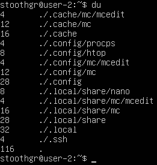

- Выведим размер папок /home, /var, /var/log в байтах,

    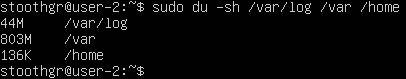

- Выведим размер папок /home, /var, /var/log в человекочитаемом виде.

    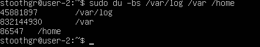

- Выведим размер всего содержимого в /var/log (не общее, а каждого вложенного элемента, используя *).

    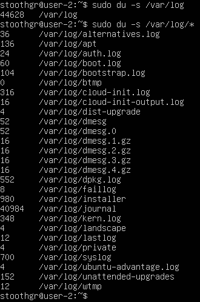

## Part 13. Установка и использование утилиты **ncdu**

- Установливаем утилиту ncdu \ `sudo apt install ncdu`.

- Выведим размер папок /home, /var, /var/log.

    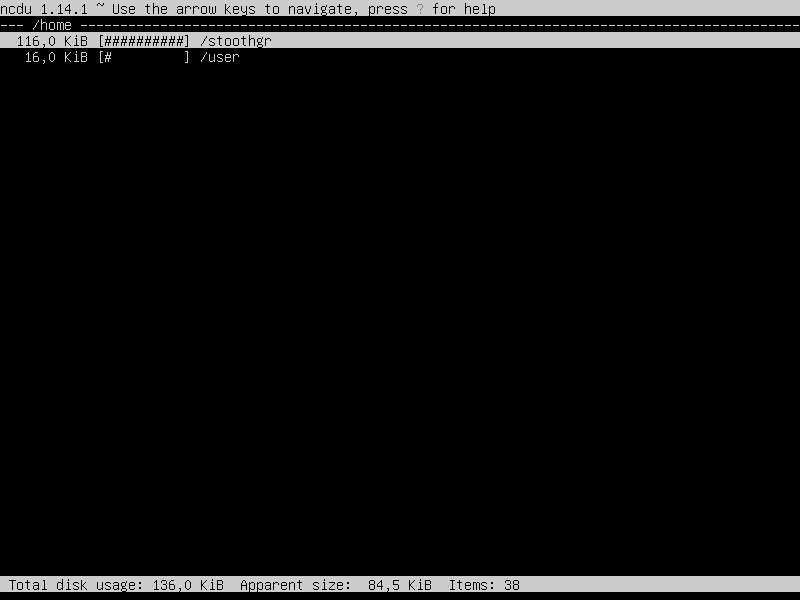

    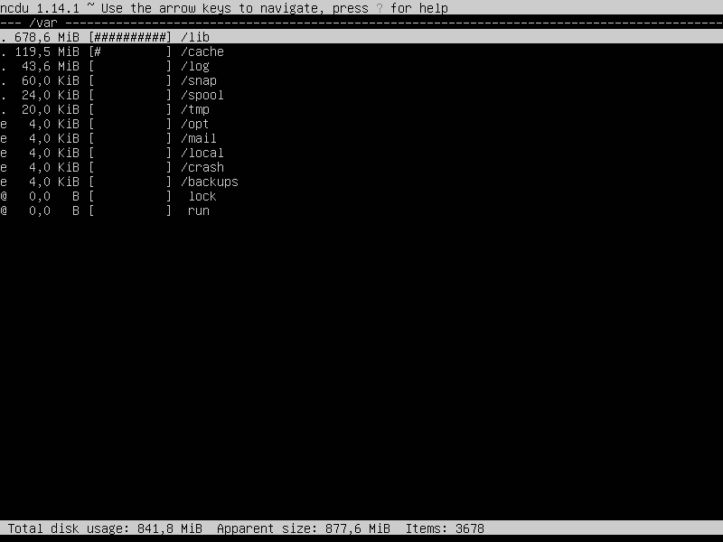

    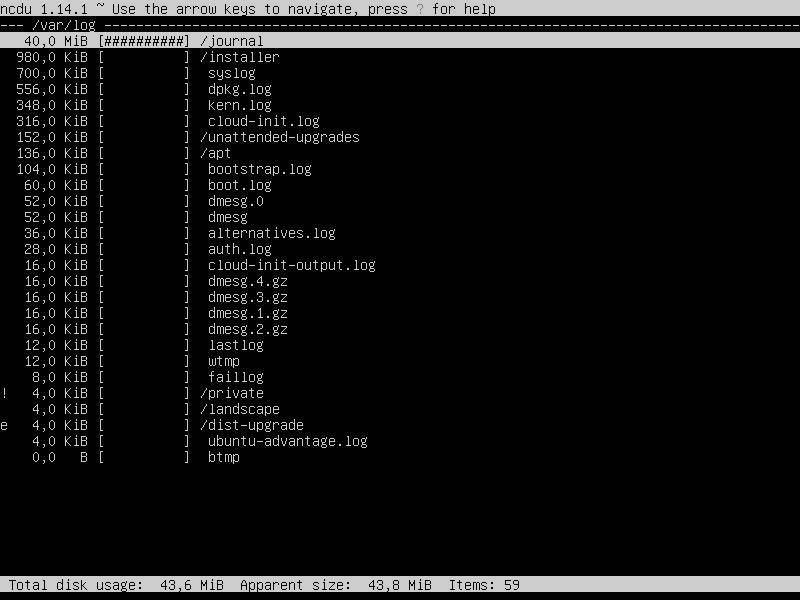

## Part 14. Работа с системными журналами

-  /var/log/dmesg

    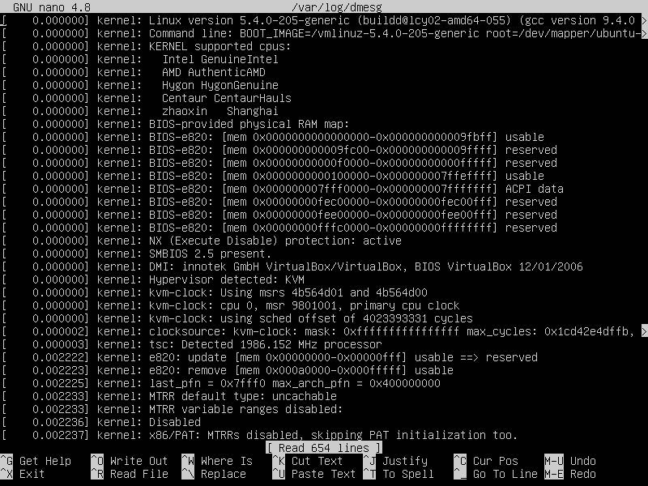

-  /var/log/syslog

    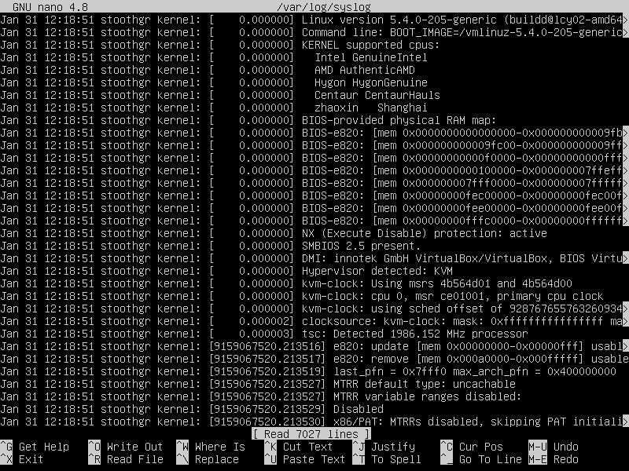

-  /var/log/auth.log

    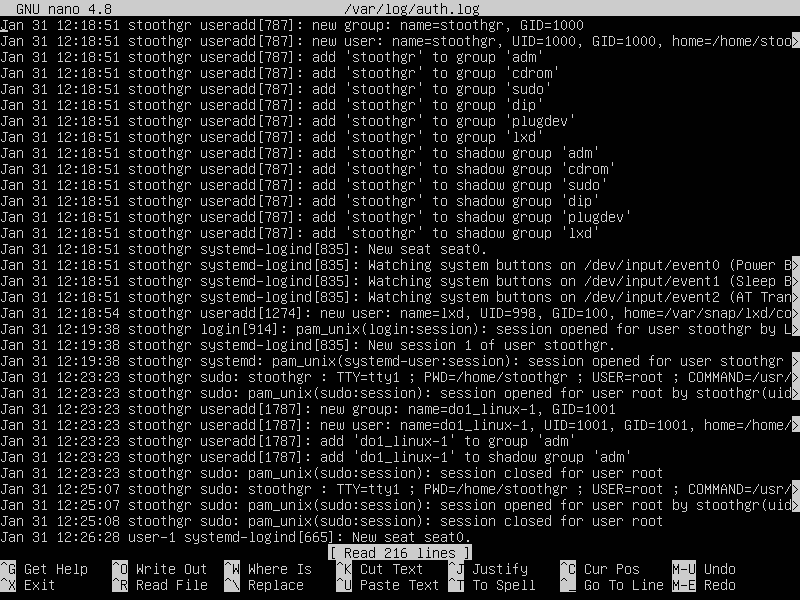

- Время последней успешной авторизации 10:30:46.
- Имя пользователя cindysna.
- Метод входа в систему с паролем systemd-logind..

- Перезапускаем службу SSHd \ `sudo systemctl restart sshd` .

    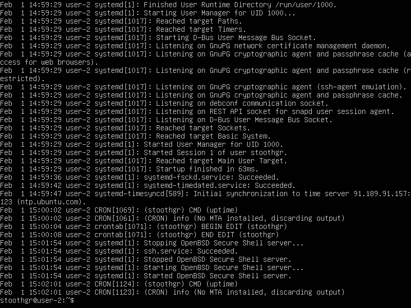

## Part 15. Использование планировщика заданий **CRON**

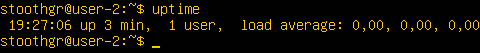

- Используя планировщик заданий, запускаем команду uptime через 2 минуты.

    `crontab -e`
    
    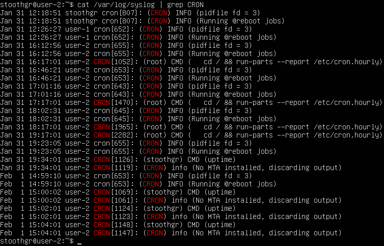
   
- Вывод на экран список текущих заданий для CRON.

    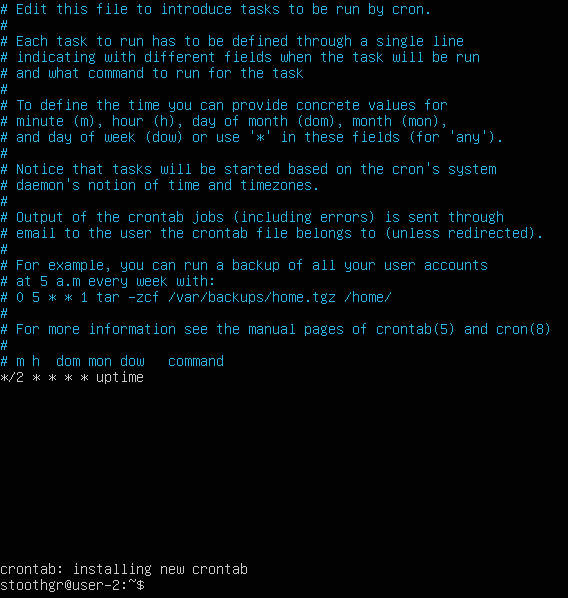

- Удаляем все задания из планировщика заданий.

    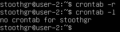