# Отчёт DO2 Linux Network
---
<!-- toc-begin -->
## Содержание

- [Отчёт DO2 Linux Network](#отчёт-do2-linux-network)
  - [Содержание](#содержание)
  - [Part 1. Инструмент ipcalc](#part-1-инструмент-ipcalc)
    - [1.1. Сети и маски](#11-сети-и-маски)
    - [1.2. localhost](#12-localhost)
    - [1.3. Диапазоны и сегменты сетей](#13-диапазоны-и-сегменты-сетей)
  - [Part 2. Статическая маршрутизация между двумя машинами](#part-2-статическая-маршрутизация-между-двумя-машинами)
    - [2.1. Добавление статического маршрута вручную](#21-добавление-статического-маршрута-вручную)
    - [2.2. Добавление статического маршрута с сохранением](#22-добавление-статического-маршрута-с-сохранением)
  - [Part 3. Утилита iperf3](#part-3-утилита-iperf3)
    - [3.1. Скорость соединения](#31-скорость-соединения)
    - [3.2. Использование утилиты iperf3](#32-использование-утилиты-iperf3)
  - [Part 4. Сетевой экран](#part-4-сетевой-экран)
    - [4.1. Утилита iptables](#41-утилита-iptables)
    - [4.2. Утилита nmap](#42-утилита-nmap)
  - [Part 5. Статическая маршрутизация сети](#part-5-статическая-маршрутизация-сети)
    - [5.1. Настройка адресов машин](#51-настройка-адресов-машин)
    - [5.2. Включение переадресации IP-адресов](#52-включение-переадресации-ip-адресов)
    - [5.3. Установка маршрута по умолчанию](#53-установка-маршрута-по-умолчанию)
    - [5.4. Добавление статических маршрутов](#54-добавление-статических-маршрутов)
    - [5.5. Построение списка маршрутизаторов](#55-построение-списка-маршрутизаторов)
    - [5.6. Использование протокола ICMP при маршрутизации](#56-использование-протокола-icmp-при-маршрутизации)
  - [Part 6. Динамическая настройка IP с помощью DHCP](#part-6-динамическая-настройка-ip-с-помощью-dhcp)
    - [6.1. Настройка службы DHCP на r2](#61-настройка-службы-dhcp-на-r2)
    - [6.2. Настройка службы DHCP на r2, с жесткой привязкой к MAC-адресу (ws11)](#62-настройка-службы-dhcp-на-r2-с-жесткой-привязкой-к-mac-адресу-ws11)
    - [6.3. Обновление ip адреса с помощью команды sudo dhclient](#63-обновление-ip-адреса-с-помощью-команды-sudo-dhclient)
  - [Part 7. NAT](#part-7-nat)
    - [7.1 Делаем сервер Apache2 общедоступным](#71-делаем-сервер-apache2-общедоступным)
    - [7.2 Создаем фаервол на r2 (как в части 4)](#72-создаем-фаервол-на-r2-как-в-части-4)
  - [Part 8. Дополнительно. Знакомство с SSH Tunnels](#part-8-дополнительно-знакомство-с-ssh-tunnels)
<!-- toc-end -->

## Part 1. Инструмент ipcalc

> **Общие сведения об ipcalc**
`ipcalc` — это полезный инструмент для сетевых администраторов и всех, кто работает с IP-адресами и подсетями. Он упрощает процесс вычисления информации о подсетях на основе IP-адреса и маски подсети.
ipcalc выполняет несколько функций:
Вычисляет сетевой адрес, широковещательный адрес и диапазон доступных IP-адресов в подсети.
Отображает маску подсети как в десятичном, так и в двоичном формате.
Предоставляет дополнительную информацию, такую как количество доступных хостов в подсети.
Использование: `ipcalc [options] <ADDRESS>[[/]<NETMASK>] [NETMASK]`.  
Опции:  
` -n ` (**--nocolor**) - подавить вывод цветов;  
` -b ` (**--nobinary**) - подавить поразрядный вывод;  
` -c ` (**--class**) - показать маску сети по адресу;  
` -h ` (**--html**) - показать результаты в HTML;  
` -v ` (**--version**) - показать версию программы;  
` -s ` (**--split n1 n2 n3**) - разделить сети по размеру n1, n2, n3;  
` -r ` (**--range**) - исключить диапазон адресов;  
` --help ` - помощь.  
Установка ipcalc: `sudo apt install ipcalc`

* Поднимаем виртуальную машину (далее -- ws1)
Ранее, в первом учебном проекте DO1_Linux установили серверную версию Ubuntu,
 без графического интерфейса.
Перед началом этого учебного проекта, сделаем экспорт виртуальной машины готовой и настроенной из первого проекта DO1_Linux.  
 В дальнейшем новую машину, можно будет брать импортом из этого образа и перенастраивать. При импорте в поле: `политика MAC-адресов`выбираем: `сгенерировать новые...`   
Экспорт и импорт делается через интерфейс VirtualBox: `инструменты`  
Перед экспортом и выполнением задания, убеждаемся (например так `ipref3 --version`)что на машинах установлены нужные утилиты, которыми будем пользоваться в ходе выполнения заданий, если их нет, то устанавливаем их командой `sudo apt install ...` 
Так же можно использовать опцию клонирования виртуальной машины, при этом также сгенерировав новые MAC адреса. 
- ipcalc
- iperf3  
- iptables  
- nmap  
- sysctl  
- tcpdump  
- traceroute  
- apache2  
- isc-dhcp-server ( для 6 задания на r1 и r2)  


### 1.1. Сети и маски

> **1.1.1. Определяем адрес сети 192.167.38.54/13**

> Как мы уже разбирали выше, **Команда ipcalc** в Linux используется для вычисления различных параметров сети на основе IP-адреса и маски подсети. В нашем случае команда ipcalc 192.167.38.54/13 выполнит расчеты для IP-адреса 192.167.38.54 с маской подсети /13.
Вот что мы можем ожидать от вывода этой команды:  
**IP-адрес:** 192.167.38.54 — это исходный IP-адрес, который мы указали.  
**Маска подсети:** /13 соответствует маске подсети 255.248.0.0. Это означает, что первые 13 бит IP-адреса используются для идентификации сети, а оставшиеся 19 бит — для идентификации хостов в этой сети.
В двоичном виде это выглядит так:
11111111.11111000.00000000.00000000
(Преобразование второго байта в десятичный формат: 
1111100 → 248 (128 + 64 + 32 + 16 + 8 = 248))  
**Адрес сети:** Это будет первый адрес в диапазоне, который определяется маской подсети. Для /13 это будет 192.160.0.0.  
**Широковещательный адрес:** Это последний адрес в диапазоне, который используется для широковещательных сообщений в сети. Для /13 это будет 192.167.255.255.  
**Диапазон хостов:** Это диапазон IP-адресов, которые могут быть назначены устройствам в этой сети. Для /13 это будет от 192.160.0.1 до 192.167.255.254.
Количество хостов: Это количество устройств, которые могут быть подключены к этой сети. Для /13 это будет 524286 хостов (2^(32-13) - 2).  
**Флаг `-b`** (или `--binary`) для того что бы включать или отключать дополнительную информацию о сети в двоичном формате. При использовании этого флага `ipcalc`, дополнительно покажет или не покажет, двоичное представление IP-адреса, маски сети и широковещательного адреса.  

Используем команду `ipcalc 192.167.38.54/13`  

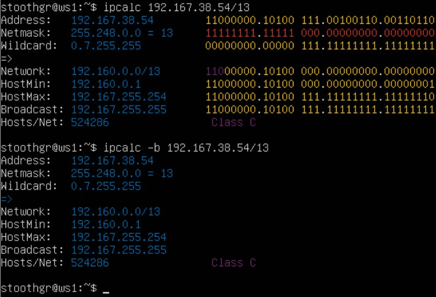  
_Скриншот №1.1.1 Результат вывода команды: `ipcalc 192.167.38.54/13`_  

> **1.1.2. Перевод маски**

**Для получения префиксной и двоичной записи маски 255.255.255.0:**

`ipcalc 192.167.38.54/255.255.255.0`

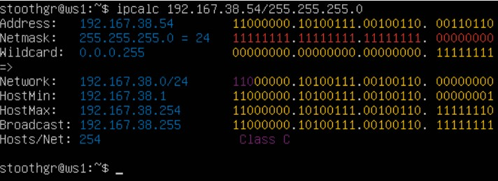  
_Скриншот №1.1.2.1 Результат вывода команды: `ipcalc 255.255.255.0`_

- Префиксная форма: /24
- Двоичная форма: 11111111.11111111.11111111.00000000

**Чтобы получить обычную и двоичную запись для маски /15:**

 `ipcalc 192.167.38.54/15`

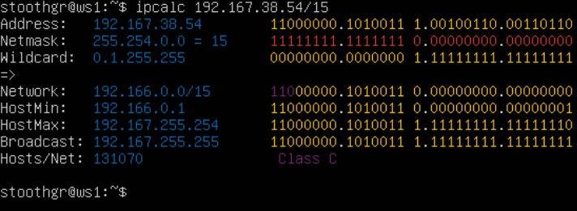

_Скриншот №1.1.2.2 Результат вывода команды: `ipcalc 192.167.38.54/15`_      

- Обычная форма: 255.254.0.0
- Двоичная форма: 11111111.11111110.00000000.00000000

**Перевод двоичной маски 11111111.11111111.11111111.11110000 в обычную и префиксную формы:**

Двоичная маска 11111111.11111111.11111111.11110000 соответствует десятичной маске 255.255.255.240.

`ipcalc 192.167.38.54/255.255.255.240`

Вывод команды содержит информацию о маске, включая её префиксную форму, которая в данном случае будет /28, так как первые 28 бит являются единицами.

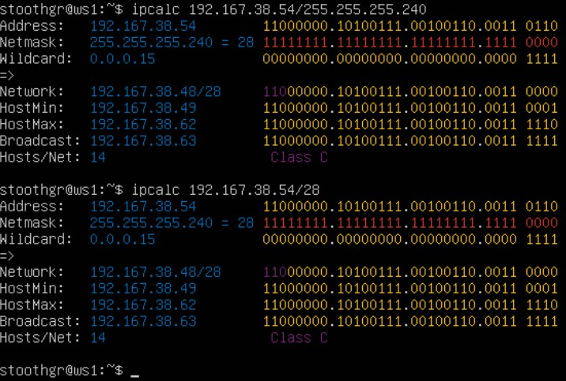  
_Скриншот №1.1.2.3 Результат вывода команды: `ipcalc 192.167.38.54/255.255.255.240`_  

- Обычная форма: 255.255.255.240
- Префиксная форма: /28

> **1.1.3. Минимальный и максимальный хост в сети 12.167.38.4 при различных масках :**

**Маска /8:**

`ipcalc 12.167.38.4/8`

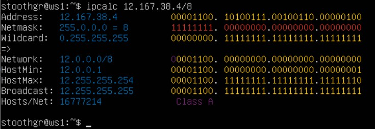  
_Скриншот №1.1.3.1 Результат вывода команды:  `ipcalc 12.167.38.4/8`_  

- HostMin: 12.0.0.1
- HostMax: 12.255.255.254

**Маска 11111111.11111111.00000000.00000000:**

Двоичная маска 11111111.11111111.00000000.00000000 соответствует десятичной маске 255.255.0.0.

`ipcalc 12.167.38.4/255.255.0.0` или `ipcalc 12.167.38.4/16`

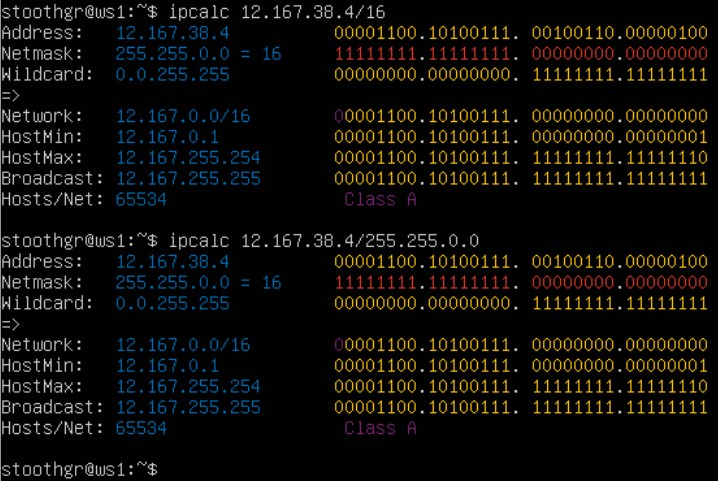  
_Скриншот №1.1.3.2 Результат вывода команды: `ipcalc 12.167.38.4/16`_  

- HostMin: 12.167.0.1
- HostMax: 12.167.255.254

**Маска 255.255.254.0:**

`ipcalc 12.167.38.4/255.255.254.0`

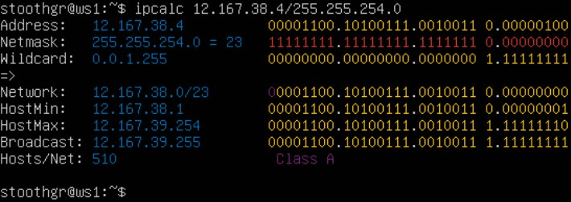  
_Скриншот №1.1.3.3 Результат вывода команды: `ipcalc 12.167.38.4/255.255.254.0`_

- HostMin: 12.167.38.1
- HostMax: 12.167.39.254

**Маска /4:**

`ipcalc 12.167.38.4/4`

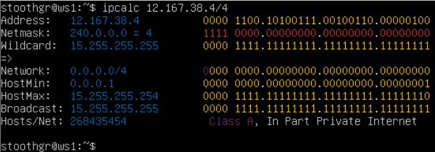  
_Скриншот №1.1.3.4 Результат вывода команды: `ipcalc 12.167.38.4/4`_

- HostMin: 0.0.0.1
- HostMax: 15.255.255.254

### 1.2. localhost

Диапазон адресов localhost (или loopback) в IPv4 составляет от 127.0.0.0 до 127.255.255.255. Этот диапазон предназначен для внутренней связи устройства с самим собой и используется для тестирования и разработки приложений.

Убедимся, можно ли обратиться к приложению, работающему на localhost, с указанными IP-адресами (194.34.23.100, 127.0.0.2, 127.1.0.1, 128.0.0.1).

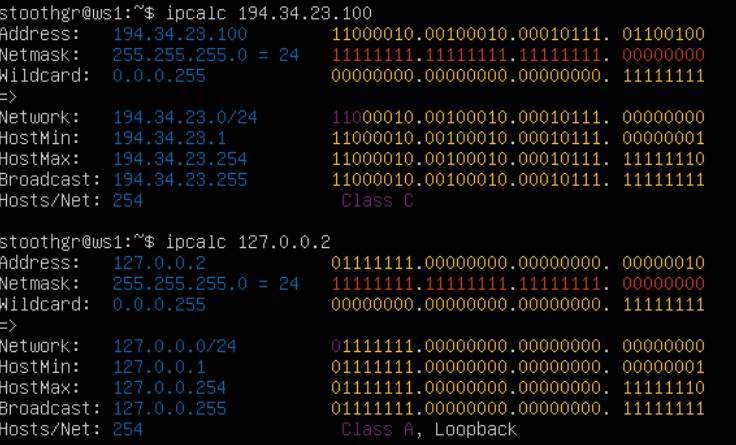  
_Скриншот №1.2.1  Результат вывода команд: `ipcalc 194.34.23.100, 127.0.0.2`_  
  
---
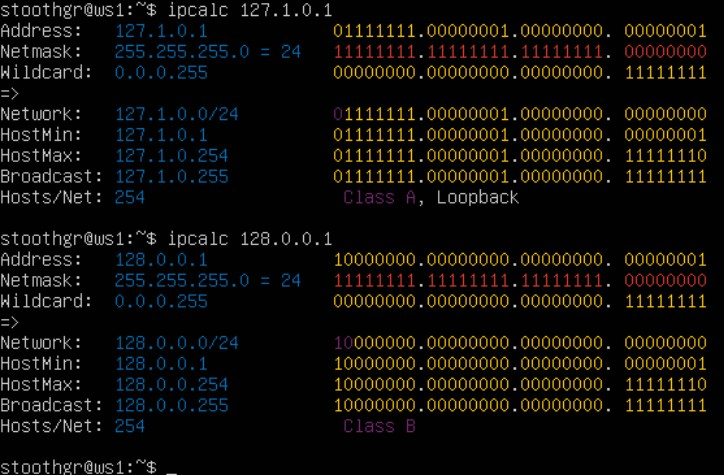  
_Скриншот №1.2.2  Результат вывода команд: `ipcalc 194.34.23.100, 127.0.0.2`_  
  
Мы проверили, можно ли обратиться к приложению на localhost с указанными IP-адресами:

**1.2.1** 194.34.23.100 – ❌ Нет
Это публичный IP-адрес, не входящий в loopback-диапазон (127.0.0.0/8).

Если приложение слушает только 127.0.0.1 (или localhost), запросы с этого адреса не будут обработаны.

 **1.2.2**  127.0.0.2 – ✅ Да
Входит в loopback-диапазон (127.0.0.0/8).

Обращение к 127.0.0.2 аналогично 127.0.0.1 – пакеты не выходят в сеть, остаются на устройстве.

**1.2.3** 127.1.0.1 – ✅ Да
Также часть loopback-диапазона.

Любой адрес вида 127.x.y.z (где x,y,z от 0 до 255) будет работать как localhost.

**1.2.4** 128.0.0.1 – ❌ Нет
Не входит в 127.0.0.0/8.

Это обычный IP-адрес (часть публичного или приватного диапазона), и он не является loopback.

Вывод:
Доступны: 127.0.0.2, 127.1.0.1 (как части 127.0.0.0/8).

Недоступны: 194.34.23.100, 128.0.0.1 (не loopback).

Если приложение слушает 0.0.0.0 (все интерфейсы), то внешние адреса (например, 194.34.23.100) могут подключиться, но это уже не связано с localhost.

### 1.3. Диапазоны и сегменты сетей

> **1.3.1. Определим, какие из перечисленных IP можно использовать в качестве публичного, а какие только в качестве частных: 10.0.0.45, 134.43.0.2, 192.168.4.2, 172.20.250.4, 172.0.2.1, 192.172.0.1, 172.68.0.2, 172.16.255.255, 10.10.10.10, 192.169.168.1**

__Публичный IP-адрес__ — это адрес, который виден в интернете и может быть использован для доступа к устройствам извне. Он уникален в глобальной сети.

__Частный IP-адрес__ — это адрес, который используется внутри локальных сетей (LAN) и не виден в интернете. Эти адреса не маршрутизируются за пределами локальной сети.

Частные IP-адреса определяются следующими диапазонами:

- Класс A: `10.0.0.0` до `10.255.255.255`
- Класс B: `172.16.0.0` до `172.31.255.255`
- Класс C: `192.168.0.0` до `192.168.255.255`


> ##### **Разделение IP-адресов на публичные и частные**

> ##### **🔒 Частные IP-адреса**  
*(Используются в локальных сетях, не маршрутизируются в интернете)*  

| IP-адрес       | Диапазон          | Класс |
|----------------|-------------------|-------|
| `10.0.0.45`    | `10.0.0.0/8`      | A     |
| `192.168.4.2`  | `192.168.0.0/16`  | C     |
| `172.20.250.4` | `172.16.0.0/12`   | B     |
| `172.16.255.255` | `172.16.0.0/12` | B     |
| `10.10.10.10`  | `10.0.0.0/8`      | A     |

> ##### **🌍 Публичные IP-адреса**  
*(Маршрутизируются в интернете, должны быть уникальными)*  

| IP-адрес       | Причина                           |
|----------------|-----------------------------------|
| `134.43.0.2`   | Не входит в частные диапазоны     |
| `172.0.2.1`    | Вне `172.16.0.0/12`               |
| `192.172.0.1`  | Не в `192.168.0.0/16`             |
| `172.68.0.2`   | Вне `172.16.0.0/12`               |
| `192.169.168.1`| Не в `192.168.0.0/16`             |

---

> ##### **📌 Проверка диапазонов:**
1. **Класс A**: `10.0.0.0` – `10.255.255.255`  
   - ✅ Частные: `10.0.0.45`, `10.10.10.10`

2. **Класс B**: `172.16.0.0` – `172.31.255.255`  
   - ✅ Частные: `172.20.250.4`, `172.16.255.255`  
   - ❌ Публичные: `172.0.2.1`, `172.68.0.2` *(вне диапазона)*  

3. **Класс C**: `192.168.0.0` – `192.168.255.255`  
   - ✅ Частный: `192.168.4.2`  
   - ❌ Публичные: `192.172.0.1`, `192.169.168.1` *(вне диапазона)*  

> **Примечание**: Адреса вне указанных частных диапазонов считаются публичными, если не зарезервированы для других целей (например, multicast, loopback).

**Делаем вывод:**

> ***К публичным относятся следующие IP адреса:*** `134.43.0.2`, `172.0.2.1`, `192.172.0.1`, `172.68.0.2`, `192.169.168.1`

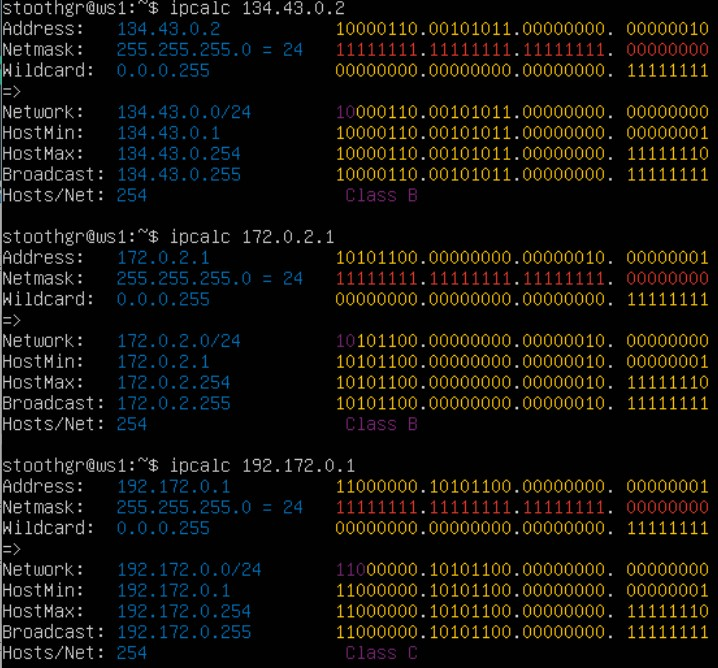  
_Скриншот №1.3.1.1 Результат вывода команд: `ipcalc 134.43.0.2`, `172.0.2.1`, `192.172.0.1`_  
  
  
_Скриншот №1.3.1.2 Результат вывода команд: `172.68.0.2`, `192.169.168.1`_

> ***К частным относятся следующие IP адреса:*** `10.0.0.45`, `192.168.4.2`, `172.20.250.4`, `172.16.255.255`, `10.10.10.10`
  
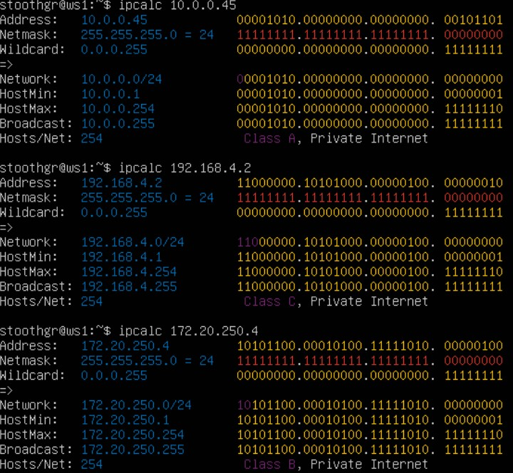  
_Скриншот №1.3.1.3 Результат вывода команд: `10.0.0.45`, `192.168.4.2`, `172.20.250.4`_   
  
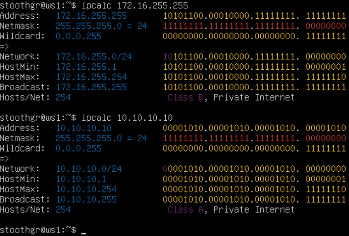  
_Скриншот №1.3.1.4 Результат вывода команд: `172.16.255.255`, `10.10.10.10`_  
  
> **1.3.2. Определим, какие из перечисленных IP-адресов шлюза возможны у сети 10.10.0.0/18: 10.0.0.1, 10.10.0.2, 10.10.10.10, 10.10.100.1, 10.10.1.255**

Определим диапазон доступных адресов в этой подсети:
>  **🔧 Использование `ipcalc` с флагами `-bn`**
- **`-b`** (--nobinary) Suppress the bitwise output.
- **`-n`** (--nocolor) Don't display ANSI color codes.

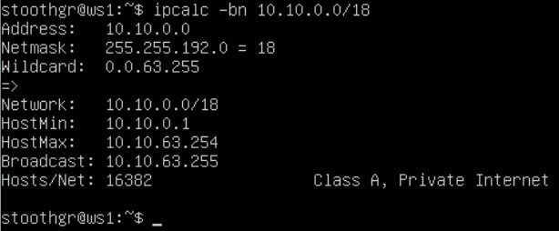
_Скриншот №1.3.2.1 Результат вывода команды: `ipcalc -bn 10.10.0.0/18`_

- Широковещательный адрес: `10.10.63.255`
- Доступные хосты: от `10.10.0.1` до `10.10.63.254`

>  **📌 Основные понятия**
>1.3.2.1. ***Шлюз (Gateway)***  
   Это устройство (обычно маршрутизатор), которое соединяет локальную сеть с другими сетями (например, интернетом). Его IP-адрес:
  > - Должен принадлежать той же подсети, что и устройства в локальной сети.
  > - Обычно выбирается первый или последний usable-адрес в диапазоне (но технически может быть любым, кроме сетевого и широковещательного).

> 1.3.2.2. **Широковещательный адрес (Broadcast)**  
  Как мы уже разбирали выше,широковещательный адрес — это специальный IP-адрес, который входит в диапазон адресов сети, потому что он предназначен для отправки данных всем устройствам в этой сети одновременно. Он формируется на основе сетевого адреса и маски подсети.  
  
> Специальный адрес вида `[сеть].[хост]`, где все биты хоста = `1`. Используется для отправки данных всем устройствам подсети одновременно.  
   **Пример**: Для `10.10.0.0/18` broadcast = `10.10.63.255`.

> 1.3.2.3. **Сетевая маска /18 в двоичном виде**  
> 11111111.11111111.11000000.00000000 (255.255.192.0)
> - Первые 18 бит — сеть, остальные 14 — хосты. 
   
> ##### **🔍 Анализ сети 10.10.0.0/18**
> - ***Сетевой адрес***: `10.10.0.0`  
> - ***Broadcast***: `10.10.63.255`  
> - ***Доступный диапазон хостов***: `10.10.0.1` – `10.10.63.254`  
  
**Проверяемые адреса**:  
| IP-адрес      | Входит в 10.10.0.0/18? | Пояснение                     |  
|---------------|------------------------|-------------------------------|   
| `10.0.0.1`    | ❌ Нет                 | Сеть `10.0.0.0/8` ≠ `10.10.0.0/18` |  
| `10.10.0.2`   | ✅ Да                  | В диапазоне `10.10.0.1–10.10.63.254` |  
| `10.10.10.10` | ✅ Да                  | В диапазоне                   |  
| `10.10.100.1` | ❌ Нет                 | `100` > `63` (выходит за broadcast) |  
| `10.10.1.255` | ✅ Да                  | Не является broadcast для /18 |  
  
>  **📝 Подробное объяснение**
1.3.2.4. **Как работает маска /18?**  
- Двоичная запись IP `10.10.0.0`:  
  ```
  00001010.00001010.00000000.00000000 (10.10.0.0)
  ```
- Маска `/18`:  
  ```
  11111111.11111111.11000000.00000000 (255.255.192.0)
  ```
- **Сеть**: Первые 18 бит (`10.10.0`), **хосты**: последние 14 бит.

1.3.2.5. **Почему `10.10.100.1` не подходит?**  
- Третий октет `100` в двоичном виде: `01100100`.  
- Для `/18` допустимы значения `00000000`–`00111111` (0–63).  
- `100` > `63` → адрес вне подсети.

1.3.2.6. **Почему `10.10.1.255` — допустимый шлюз?**  
- Это обычный хост-адрес, так как broadcast для /18 = `10.10.63.255`.  
- Для сравнения: в сети `/24` broadcast был бы `10.10.1.255`, но `/18` дает больший диапазон.

>  **🎯 Итоговый ответ**
**Возможные адреса шлюза**:  
✅ `10.10.0.2`  
✅ `10.10.10.10`  
✅ `10.10.1.255`  

**Недопустимые адреса**:  
❌ `10.0.0.1` (другая сеть)  
❌ `10.10.100.1` (выходит за broadcast)  
  
## Part 2. Статическая маршрутизация между двумя машинами

  
> __Поднимаем две виртуальные машины (далее -- ws1 и ws2).__

 Для поднятия ws2, используем опцию клонирования виртуальной машины ws1, при этом сгенерировав новые MAC адреса, так как мы делали первой части отчёта.  

В настройках VirtualBox каждой машины во вкладке `Сеть` для `Адаптер 1` задаем `Тип подключения: Внутренняя сеть`.

> **2.0.1. С помощью команды `ip a` смотрим существующие сетевые интерфейсы:**

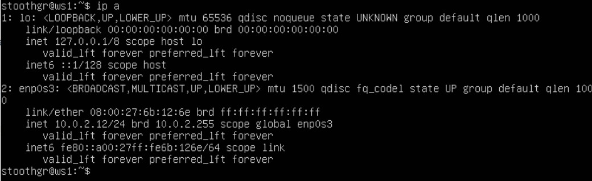
_Скриншот №2.0.1.1 Результат вывода команды: `ip a` на ws1_  
  
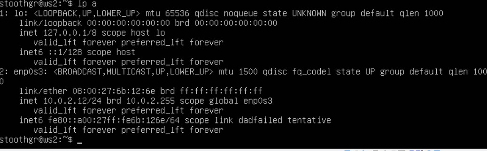
_Скриншот №2.0.1.2 Результат вывода команды: `ip a` на ws2_  
  
> **2.0.2. Описываем сетевой интерфейс, соответствующий внутренней сети, на обеих машинах и задаём следующие адреса и маски:
>  ws1 — 192.168.100.10, маска /16,
>  ws2 — 172.24.116.8, маска /12.**  
  
Выключаем машины.  
В настройках VirtualBox для каждой машины, во вкладке: `Сеть` для: `Адаптер 1` задаем: `Тип подключения: NAT`, `Адаптер 2` задаем: `Тип подключения: Внутренняя сеть`  
Запускаем машины.
  
Вносим изменения в конфигурационный файл для установки в нём необходимого статического адреса.

`sudo nano /etc/netplan/00-installer-config.yaml`

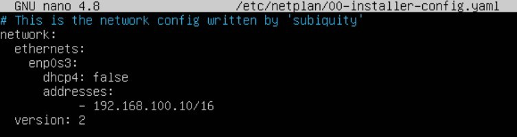  
_Скриншот №2.0.2.1 Отредактированный файл: `/etc/netplan/00-installer-config.yaml`  на ws1_  
  
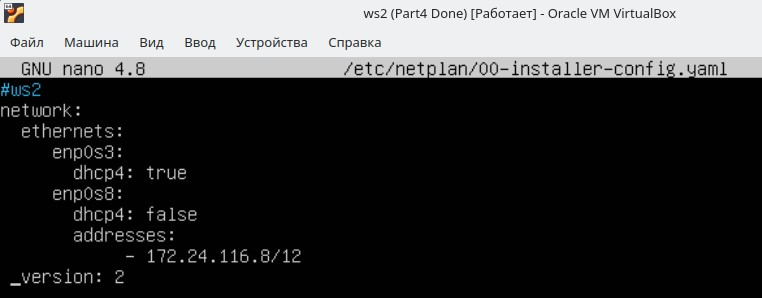  
_Скриншот №2.0.2.2 Отредактированный файл: `/etc/netplan/00-installer-config.yaml`  на ws2_
  
> **2.0.3. Выполним команду `netplan apply` для перезапуска сервиса сети.**
После выполнения на ws1 и ws2  команды `sudo netplan apply`,  
проверим вступившие в силу изменения с помощью `ip a`  
  

_Скриншот №2.0.3.1 Результат вывода команды: `ip a` на ws1_  
  
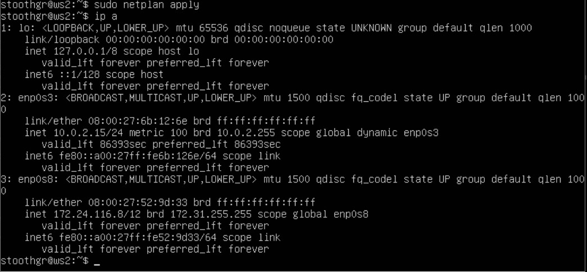
_Скриншот №2.0.3.2 Результат вывода команды: `ip a` на ws2_  
  
### 2.1. Добавление статического маршрута вручную

Добавим и проверим, статический маршрут от одной машины до другой и обратно при помощи команд: `ip r add < >`, `ip r`  

- Для ws1:`sudo ip r add 172.24.116.8 dev enp0s8`,  `sudo ip r`
  
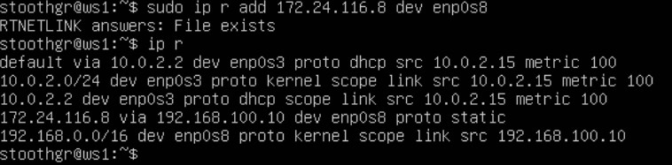  
_Скриншот №2.1.0.1 Результат вывода команд: `sudo ip r add 172.24.116.8 dev enp0s8`, `sudo ip r` на ws1_  
   
- Для ws2:`sudo ip r add 192.168.100.0 dev enp0s8`, `sudo ip r`
  
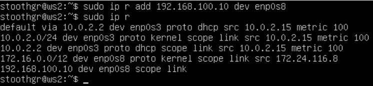  
_Скриншот №2.1.0.2 Результат вывода команд: `sudo ip r add 192.168.100.0 dev enp0s8`,  `sudo ip r` на ws2_

Проверяем утилитой `ping` связь между машинами:  
  
- Для ws1: `ping 172.24.116.8 -c 4`  

- Для ws2: `ping 192.168.100.10 -c 4`  
  
Убеждаемся что на обоих машинах выводиться сообщение: `0% packet loss`  
  
  
_Скриншот №2.1.0.3 Результат вывода команд: `ping 172.24.116.8 -c 4` на ws1_
  
  
_Скриншот №2.1.0.4 Результат вывода команд: `ping 192.168.100.10 -c 4` на ws2_  
  
С помощью команды `netstat` (аналогичная команда `ip r` или `ip route`) проверяем адреса машин

- `-n` - отбражение адресов в числовом виде
- `-r` - отображение в виде таблицы

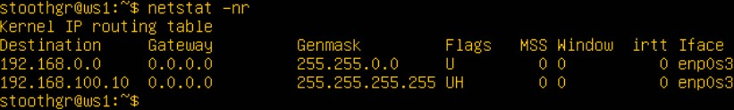  
_Скриншот №2.1.0.5 Результат вывода команд: `netstat -nr` на ws1_  
  
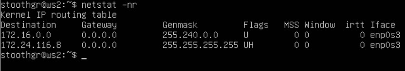  
_Скриншот №2.1.0.6 Результат вывода команд: `netstat -nr` на ws2_
  

### 2.2. Добавление статического маршрута с сохранением
  
Перезапускаем машины.  
Так как после перезапуска машин, наши настройки статических маршрутов 
не сохранились, добавляем статические маршруты в файлы конфигурации обеих машин:

`sudo nano /etc/netplan/00-installer-config.yaml`  
  
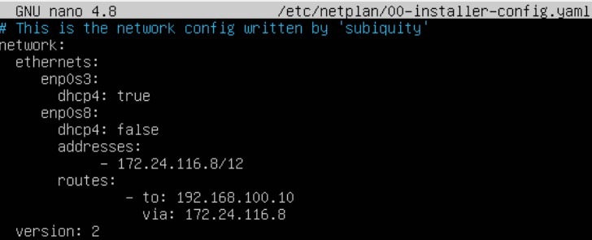  
_Скриншот №2.2.1 Добавляем статический маршрут в:
 `/etc/netplan/00-installer-config.yaml`  на ws1_  
   
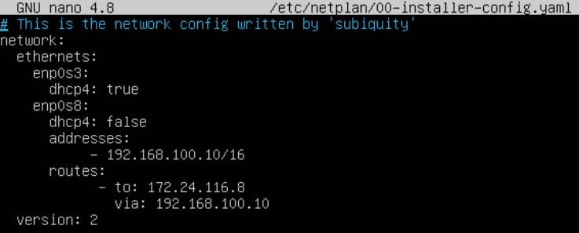  
_Скриншот №2.2.2 Добавляем статический маршрут в:
 `/etc/netplan/00-installer-config.yaml`  на ws2_
  
Выполняем команду `netplan apply` и вновь проверяем утилитой `ping` связь между машинами:  
  
Убеждаемся что на обоих машинах выводиться сообщение: `0% packet loss`  
  
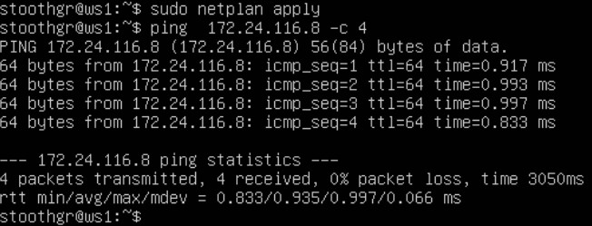   
_Скриншот №2.2.3 Результат вывода команд: 
`netplan apply` и `ping 172.24.116.8 -c 4` на ws1_   
  
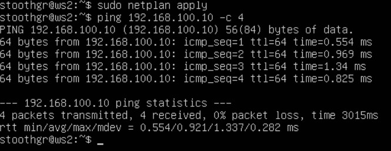   
_Скриншот №2.2.4 Результат вывода команд: 
`netplan apply` и `ping 172.24.116.8 -c 4` на ws2_  
  
[🔼вернуться к содержанию](#содержание)

## Part 3. Утилита iperf3

### 3.1. Скорость соединения

Основные единицы измерения скорости передачи данных:  
  
| Единица              | Обозначение       | Соотношение                  | Пример использования          |
|-----------------------|-------------------|------------------------------|--------------------------------|
| **Бит в секунду**     | бит/с, bps        | 1 бит/с                      | Низкоскоростные устройства     |
| **Килобит в секунду** | Кбит/с, Kbps      | 1 Кбит/с = 1 000 бит/с       | Модемы, VoIP                   |
| **Мегабит в секунду** | Мбит/с, Mbps      | 1 Мбит/с = 1 000 Кбит/с      | Широкополосный интернет        |
| **Гигабит в секунду** | Гбит/с, Gbps      | 1 Гбит/с = 1 000 Мбит/с      | Оптоволоконные сети            |
| **Терабит в секунду** | Тбит/с, Tbps      | 1 Тбит/с = 1 000 Гбит/с      | Магистральные каналы связи     |
| **Байт в секунду**    | Б/с, Bps          | 1 Б/с = 8 бит/с              | Скорость загрузки файлов       |
| **Килобайт в секунду**| КБ/с, KBps        | 1 КБ/с = 8 Кбит/с = 8 000 бит/с | Локальные сети, HDD/SSD       |
| **Мегабайт в секунду**| МБ/с, MBps        | 1 МБ/с = 8 Мбит/с = 8 000 000 бит/с | USB, SATA, SSD             |
| **Гигабайт в секунду**| ГБ/с, GBps        | 1 ГБ/с = 8 Гбит/с            | Высокоскоростные интерфейсы (PCIe) |

>Примечания:
> - 1 байт = 8 бит – важно при конвертации между битами и байтами.
> - Кбит/с ≠ КБ/с – например, 100 Мбит/с ≈ 12.5 МБ/с.
> - В телекоммуникациях (провайдеры) используют биты, в ПО (браузеры, торренты) – байты.  
Важно помнить, что при измерении скорости передачи данных обычно используются десятичные приставки (например, килобит = 1000 бит), а не двоичные (где килобит равен $ 2^{10} $ бит).  
  #!/bin/sh
**Исходя из этих данных:**  
> 8 Mbps (мегабит в секунду) = ? MB/s (мегабайт в секунду)  
✅ 1 байт = 8 бит → 1 мегабайт (MB) = 8 мегабит (Mb)  
🔹 8 Mbps ÷ 8 = 1 MB/s  
  
Ответ:  
* 8 Mbps = 1  MB/s (8 мегабит в секунду = 1 мегабайт в секунду).  
  
>100 MB/s (мегабайт в секунду) = ? Kbps (килобит в секунду)  
✅ 1 MB/s = 8 Mbps (поскольку 1 байт = 8 бит)  
✅ 1 Mbps = 1000 Kbps  
🔹 100 MB/s × 8 = 800 Mbps  
🔹 800 Mbps × 1000 = 800 000 Kbps    
  
Ответ:  
* 100 MB/s = 800000 Kbps (100 Мегабайт в секунду = 800000 килобит в секунду).  
  
> 1 Gbps (гигабит в секунду) = ? Mbps (мегабит в секунду)
✅ 1 Гбит/с = 1000 Мбит/с (десятичная система, как у всех битовых единиц)
  
Ответ:  
* 1 Gbps = 1000 Mbps (1 гигабит в секунду = 1000 мегабит в секунду).   

### 3.2. Использование утилиты iperf3
  
`iperf3` — это мощная кроссплатформенная утилита, предназначенная для тестирования пропускной способности сети. Она позволяет измерять максимальную пропускную способность между двумя узлами сети, генерируя TCP и UDP трафик.  
  
`iperf3` работает в режиме клиента и сервера, что позволяет проводить тесты между двумя компьютерами. Один компьютер запускает сервер с помощью команды `iperf3 -s`, а другой подключается к нему как клиент с помощью команды `iperf3 -c <IP-адрес>`.  
  
На машине `ws1`, которая будет выступать в роли сервера, выполняем команду:  
  
`iperf3 -s`  
  
Машина будет находится в режиме ожидания, пока мы не запустим на `ws2`, которая будет выступать в роли клиента команду `iperf3 -c 192.168.100.0`  
  
После выполнения команды на клиенте мы получаем вывод, содержащий информацию о скорости передачи данных и других параметрах.  
  
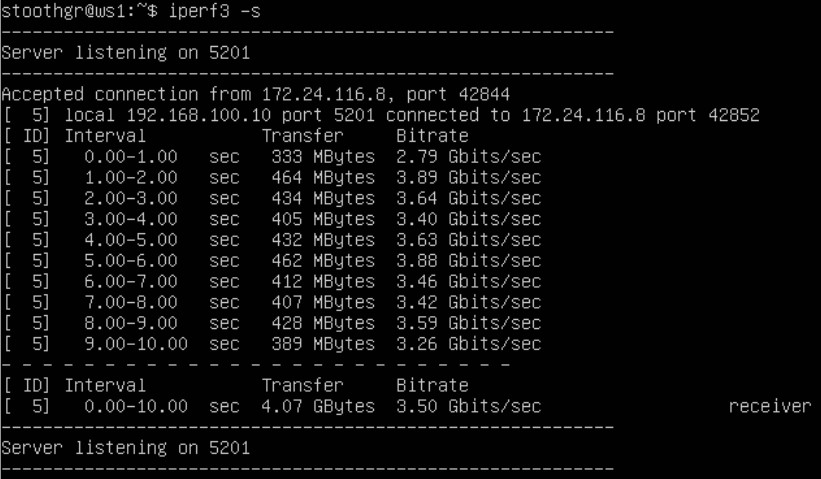   
_Скриншот №3.2.1 iperf3 в режиме сервера на ws1_   
  
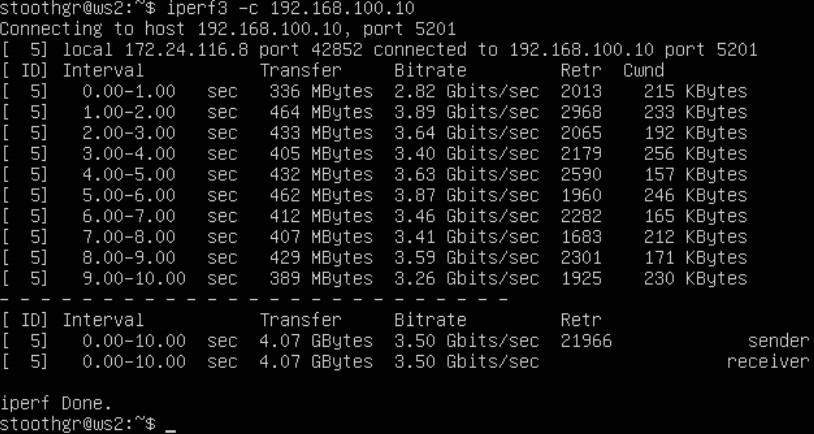   
_Скриншот №3.2.2 iperf3 в режиме клиента на ws2_  
  
[🔼вернуться к содержанию](#содержание)

## Part 4. Сетевой экран

Сетевой экран, также известный как межсетевой экран или брандмауэр представляет собой программное или аппаратное средство, предназначенное для защиты компьютерных сетей от несанкционированного доступа и различных киберугроз. Он контролирует и фильтрует сетевой трафик на основе заранее заданных правил.

### 4.1. Утилита iptables

**iptables** — это утилита командной строки, которая служит стандартным интерфейсом для управления встроенным в ядро Linux брандмауэром Netfilter. Она позволяет администраторам настраивать правила фильтрации пакетов данных, определяя, какие пакеты могут проходить через сетевой интерфейс, а какие должны быть заблокированы.

Создаем и редактируем файл `/etc/firewall.sh`, имитирующий файрвол, на `ws1` и `ws2` с помощью команды

`sudo nano /etc/firewall.sh`

Добавляем в файл следующие правила согласно задания:

1) На ws1 применяем стратегию, когда в начале пишется запрещающее правило, а в конце пишется разрешающее правило (это касается пунктов 4 и 5).

2) На ws2 применяем стратегию, когда в начале пишется разрешающее правило, а в конце пишется запрещающее правило (это касается пунктов 4 и 5).

3) Открываем на машинах доступ для порта 22 (ssh) и порта 80 (http).

4) Запрещаем echo reply (машина не должна «пинговаться», т. е. должна быть блокировка на OUTPUT).

5) Разрешаем echo reply (машина должна «пинговаться»).  
  
Файлы `firewall.sh`  
  
Заносим данные в файл имитирующий файрвол: /etc/firewall.sh для ws1 (стратегия "deny first"):  
  
```bash
#!/bin/sh

# Очистка всех правил
# Flush all rules
iptables -F
iptables -X

# Разрешаем SSH (22) и HTTP (80)
# Allow SSH(22) and HTTP(80)
iptables -A INPUT -p tcp --dport 22 -j ACCEPT
iptables -A INPUT -p tcp --dport 80 -j ACCEPT

# Разрешаем echo reply (правило 1 в стратегии)
# Deny echo reply (primary rule)
iptables -A OUTPUT -p icmp --icmp-type echo-reply -j DROP

# Запрещаем echo reply (правило 2 в стратегии)
# Allow echo reply (secondary rule - won't override deny)
iptables -A OUTPUT -p icmp --icmp-type echo-reply -j ACCEPT

# Сохраняем правила в формате, пригодном для восстановления
# Save rules in iptables-restore format (prints to console)
echo "Rules in iptables-save format:"
/sbin/iptables-save  # Outputs rules in a format suitable for persistence
```
  
Заносим данные в файл имитирующий файрвол: /etc/firewall.sh для ws2 (стратегия "allow first"):  
  
```bash
#!/bin/sh

# Очистка всех правил
# Flush all rules
iptables -F
iptables -X

# Разрешаем SSH (22) и HTTP (80)
# Allow SSH(22) and HTTP(80)

iptables -A INPUT -p tcp --dport 22 -j ACCEPT
iptables -A INPUT -p tcp --dport 80 -j ACCEPT

# Разрешаем echo reply (правило 1 в стратегии)
# Allow echo reply (primary rule)
iptables -A OUTPUT -p icmp --icmp-type echo-reply -j ACCEPT

# Запрещаем echo reply (правило 2 в стратегии)
# Deny echo reply (secondary rule - won't overrides allow)
iptables -A OUTPUT -p icmp --icmp-type echo-reply -j DROP

# Сохраняем правила в формате, пригодном для восстановления
# Save rules in iptables-restore format (prints to console)
echo "Rules in iptables-save format:"
/sbin/iptables-save  # Outputs rules in a format suitable for persistence
```
    
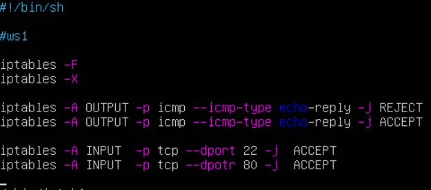  
_Скриншот №4.1.1 Файл имитирующий файрвол /etc/firewall.sh на ws1_  
  
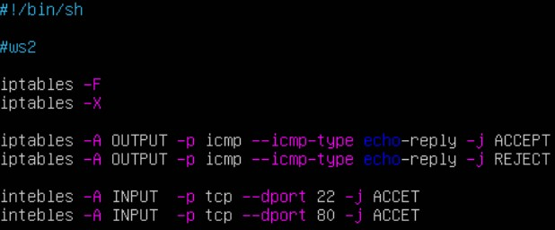     
_Скриншот №4.1.2 Файл имитирующий файрвол /etc/firewall.sh на ws2_   
  
Запустим скрипт на обеих машинах:  

`sudo chmod +x /etc/firewall.sh`  
  
`sudo bash /etc/firewall.sh`  
  
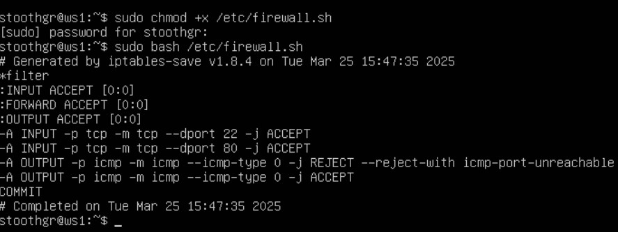  
_Скриншот №4.1.3 Выполнение /etc/firewall.sh на ws1_  
  
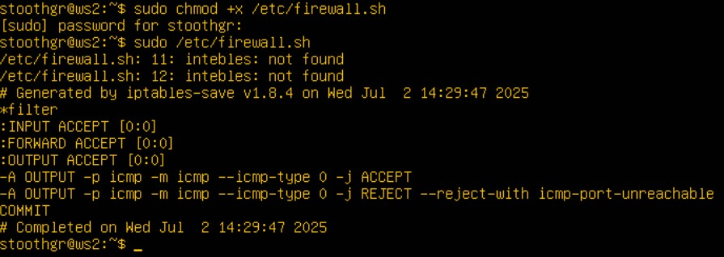  
_Скриншот №4.1.4 Выполнение /etc/firewall.sh на ws2_  
  
Разница между стратегиями, применёнными в первом и втором файлах, заключается в порядке правил для блокировки и разрешения эхо-ответов (ICMP echo-reply). На `ws1` сначала идет правило, запрещающее эхо-ответы, а затем правило, разрешающее эхо-ответы.  
 На `ws2` сначала идет правило, разрешающее эхо-ответы, а затем правило, запрещающее эхо-ответы. 

При первой стратегии (применена на ws1) пинг этой виртуальной машины будет запрещен, а при второй стратегии (ws2)
разрешен.  
Правила применяются по порядку и если есть два противоречащих друг другу правила, то
выполнится то, которое стоит первым в списке правил.
Таким образом, если например, первым в списке правил, стоит запрещающее правило, оно не будет перезаписано разрешающим правилом, которое в списке идёт после него.

### 4.2. Утилита nmap

Утилита Nmap (Network Mapper) является инструментом для исследования сети и проверки безопасности. Она используется для сканирования хостов и сетей, позволяя определить доступные устройства, открытые порты, работающие сервисы и их версии, а также операционные системы, используемые на этих устройствах.

**Основные функции Nmap:**

- Сканирование хостов: Nmap позволяет определить, какие устройства активны в сети.
- Проверка открытых портов: Утилита может сканировать порты на наличие открытых или закрытых соединений.
- Определение сервисов и версий: Nmap может выявить, какие сервисы работают на определённых портах и их версии.
- Аудит безопасности: Используется для выявления уязвимостей в сетевой инфраструктуре.

Найдем машину, которая не отвечает на ping. Выполняем команды:

- Для ws1: `ping -c 3 172.24.116.8`

- Для ws2: `ping -c 3 192.168.100.10`
  

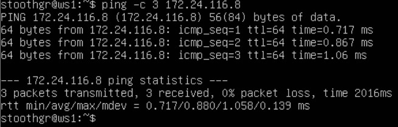  
_Скриншот №4.2.1 Выполнение команды ping на ws1_  
  
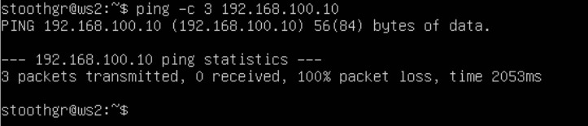  
_Скриншот №4.2.2  Выполнение команды ping на ws2_  
  
Видим, что `ws1` не пингуется, так как firewall настроен на блокировку ответов на ICMP echo reply.  
  
Запускаем утилиту `nmap` (в выводе нас интересует наличие строки `Host is up`)
  
`sudo nmap 192.168.100.10`  
  
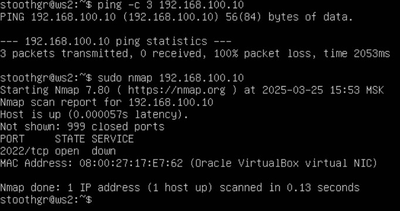  
_Скриншот №4.2.1 Выполнение команды `nmap` на ws2, для обнаружения ws1_  
  
Таким образом, утилита `nmap` показала нам, что хост машины ws1 запущен.  
  
Делаем дампы образов `ws1` `ws2`  
  
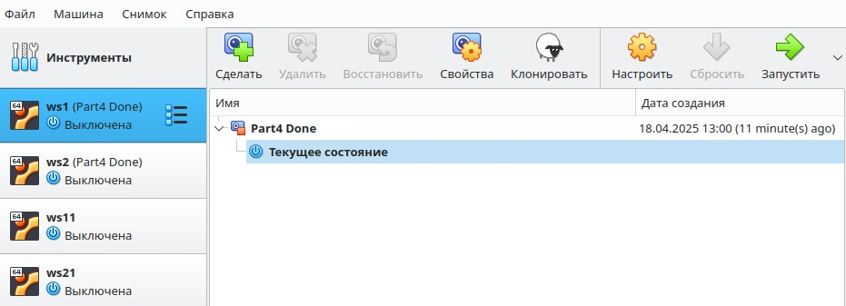  
_Скриншот №4.2.4 Дампы образов `ws1` `ws2`_    
  
[🔼вернуться к содержанию](#содержание)
  
## Part 5. Статическая маршрутизация сети
  

  
### 5.1. Настройка адресов машин

- Настраиваем конфигурации машин в *etc/netplan/00-installer-config.yaml* согласно сети на рисунке.  
  
* Поднимаем пять виртуальных машин (3 рабочие станции (ws11, ws21, ws22) и 2 роутера (r1, r2)).
  
> В наших виртуальных машинах, по умолчанию,  включены современные: `Predictable Network Interface Names` (предсказуемые имена
сетевых интерфейсов), вида: `enp0s3`, `enp0s8` и.т.д,  вместо использовавшихся в прежних версиях 
linux имён: `eth0`, `eth1`, и.т.д.  
Но при этом устаревшие имена: `eth0`, `eth1`, прямо указаны нам в задании на схеме сети, в качестве имён, которые мы должны 
использовать.  
Из несколких существующих способов такого периеменования, (например через отключение предсказуемых имён путём изменения загрузчика GRUB), выберем ручное прописывание имён в netplan.  
Поэтому, в netplan - файлах конфигурации сети, выполним переименование наших предсказуемых имён интерфейсов: `enp0s3`, `enp0s8`, 
приведя их к виду, указанному в задании: `eth0`, `eth1`.  
  
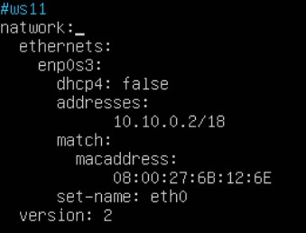  
_Скриншот №5.1.1 Файл настроек: `/etc/netplan/00-installer-config.yaml`  на ws11_  
  
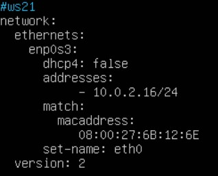  
_Скриншот №5.1.2 Файл настроек: `/etc/netplan/00-installer-config.yaml`  на ws21_  
  
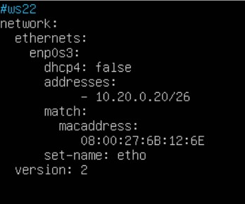  
_Скриншот №5.1.3 Файл настроек: `/etc/netplan/00-installer-config.yaml`  на ws22_  
  
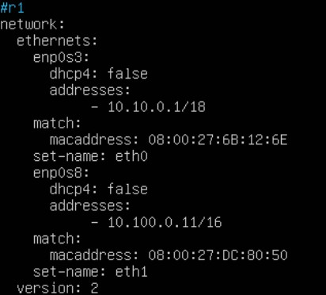  
_Скриншот №5.1.4 Файл настроек: `/etc/netplan/00-installer-config.yaml`  на r1_  
  
  
_Скриншот №5.1.5 Файл настроек: `/etc/netplan/00-installer-config.yaml`  на r2_  
  
-  Перезапускаем сервис сети на машинах командами `sudo netplan apply` и `sudo service systemd-networkd restart`.  

> Команда sudo `service systemd-networkd restart` (или эквивалентная `sudo systemctl restart systemd-networkd`) выполняется после `sudo netplan apply` для того, чтобы гарантировать, что все изменения конфигурации сети корректно применились и система управления сетью в Linux полностью их обработала.
  
Если ошибок нет, командой `ip -4 a` проверяем, что адрес машины задан верно.  
Также пропингуем ws22 с ws21. Аналогично пропингуем r1 с ws11.  
- В отчёт помещаем скрины с вызовом и выводом использованных команд.
  
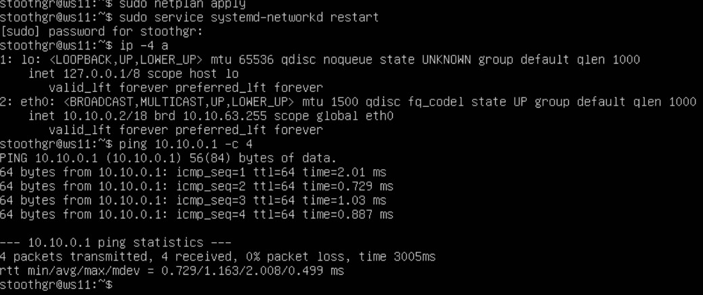
_Скриншот №5.1.6 Проверка адреса машины на ws11_  
  
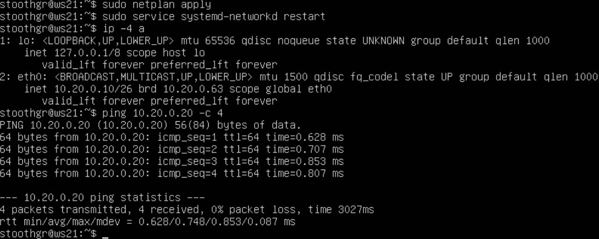
_Скриншот №5.1.7 Проверка адреса машины на ws21_
  
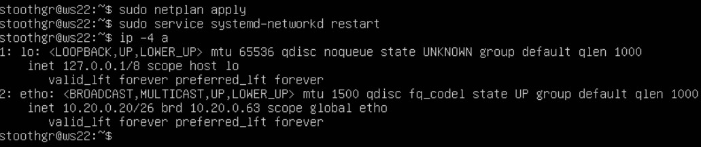  
_Скриншот №5.1.8 Проверка адреса машины на ws22_  
   
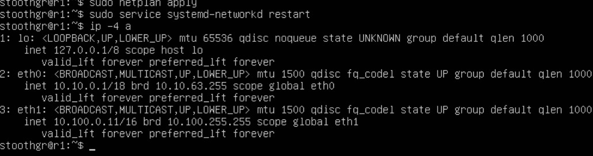
_Скриншот №5.1.9 Проверка адреса машины на r1_  
  
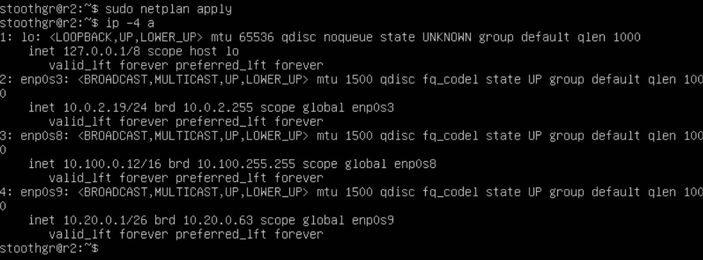  
_Скриншот №5.1.10 Проверка адреса машины на r2_  
  
### 5.2. Включение переадресации IP-адресов
- Для включения переадресации IP выполним команду на роутерах:
`sysctl -w net.ipv4.ip_forward=1`
  
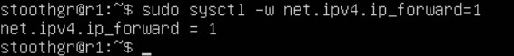  
_Скриншот №5.2.1 Включение переадресации на r1_  
  
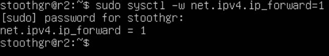  
_Скриншот №5.2.2 Включение переадресации на r2_  

*При таком подходе переадресация не будет работать после перезагрузки системы.*  
  
Для включения на постоянной основе, нужно в файл */etc/sysctl.conf* добавить следующую строку:  
`net.ipv4.ip_forward = 1`  
  
- Открываем на `r1` и на `r2` */etc/sysctl.conf* и расскомментируем эту строку.  
  
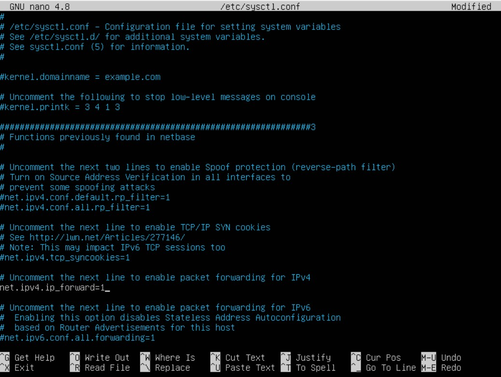
_Скриншот №5.2.3 Включение переадресации на постоянной основе_
  
*При использовании этого подхода, IP-переадресация включена на постоянной основе.*

### 5.3. Установка маршрута по умолчанию
  
- Настраиваем маршрут по умолчанию (шлюз) для рабочих станций. Для этого добавлям `default` перед IP-роутера в файле конфигураций.  
  
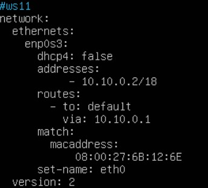
_Скриншот №5.3.1 Маршрут по умолчанию (шлюз) для ws11_  
  
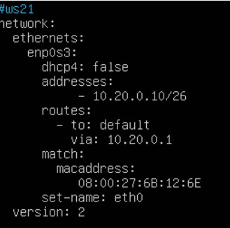
_Скриншот №5.3.2 Маршрут по умолчанию (шлюз) для ws21_  
  
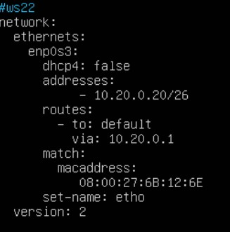
_Скриншот №5.3.3 Маршрут по умолчанию (шлюз) для ws22_  
  
- Вызываем `ip r` и показываем, что добавился маршрут в таблицу маршрутизации.
  
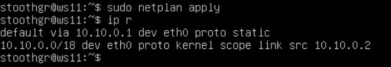
_Скриншот №5.3.4 Команда `ip r` показала что добавился маршрут на ws11_  
  
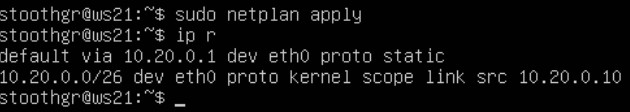
_Скриншот №5.3.5 Команда `ip r` показала что добавился маршрут на ws21_  
  
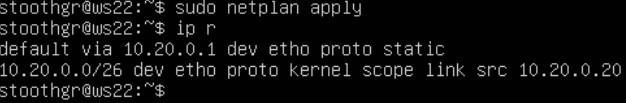
_Скриншот №5.3.6 Команда `ip r` показала что добавился маршрут на ws22_  
  
- Пропингуем с ws11 роутер r2 и покажем на r2, что пинг доходит.
> Запускаем на `r2` утилиту `tcpdump`, она позволяет прослушать порты и вывести на экран информацию с каких IP адресов приходят пакеты.  
  
-  Для этого используем команду:
`tcpdump -tn -i eth0`  
  
После этого пингуем с `ws11` роутер `r2`  
  
`ping -c 5 10.100.0.12`  

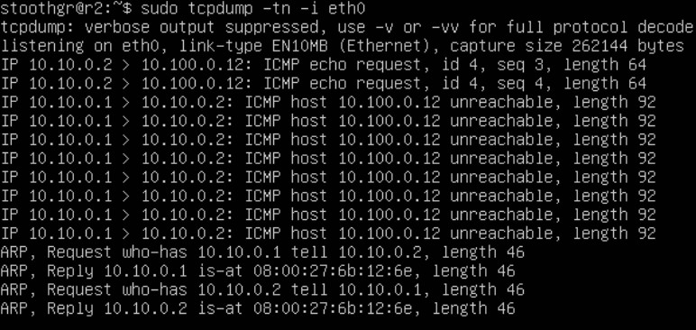
_Скриншот №5.3.7 Выполнение команды `ping -c 5 10.100.0.12` на ws11_
  
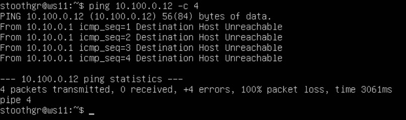
_Скриншот №5.3.8 Команда `tcpdump -tn -i eth0` показала что пинг доходит с ws11 на r2_  
  
В итоге, помощью команды `tcpdump` мы видим, что пакеты c ws11 на r2 доходят, несмотря на то, что на ws11 написано, что r2 не пингуется.
  
### 5.4. Добавление статических маршрутов
  
- Добавляем в роутеры r1 и r2 статические маршруты в файле конфигураций.  
  
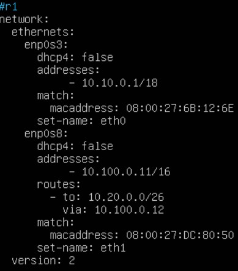
_Скриншот №5.4.1 Добавление статического маршрута в роутер r1_  
  
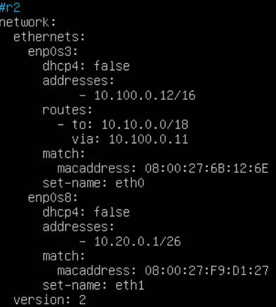
_Скриншот №5.4.2 Добавление статического маршрута в роутер r2_  

- применяем изменения `sudo netplan apply`
  
- Вызоваем `ip r` чтобы показать таблицы с маршрутами на обоих роутерах.  
  
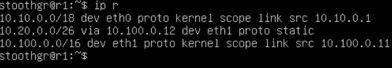
_Скриншот №5.4.3 Таблица с маршрутами на r1_  
  
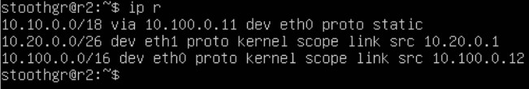
_Скриншот №5.4.4 Таблица с маршрутами на r2_  
  
-  Запускам команду на ws11:
`ip r list 10.10.0.0/[маска сети]` и `ip r list 0.0.0.0/0`

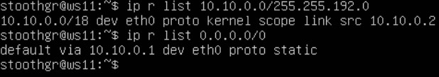
_Скриншот №5.4.5 вывод команды `ip r list` на ws11_  

- Так же, делаем вывод, почему для адреса 10.10.0.0/[маска сети] был выбран маршрут,
отличный от 0.0.0.0/0, хотя он попадает под маршрут по умолчанию:  

Причина выбора маршрута 10.10.0.0/18, вместо маршрута по умолчанию 0.0.0.0/0, заключается
в том, что маршруты к конкретным подсетям имеют более высокий приоритет, чем маршрут
по умолчанию.   
  
> Специфичность маршрутов:    
  
- Когда система ищет маршрут для IP-адреса, она сначала проверяет таблицу маршрутизации 
- на наличие более специфичных маршрутов, которые могут соответствовать этому адресу.
-  В данном случае маршрут 10.10.0.0/18 является более специфичным, чем маршрут
-   по умолчанию 0.0.0.0/0, так как он явно указывает на определённую подсеть.
  
> Приоритет маршрутов:  
  
- В Linux маршруты с более высокой спецификой (т.е., меньшей длиной маски)
имеют приоритет над маршрутами по умолчанию. Это означает, что если есть явный маршрут
к подсети, который соответствует адресу назначения, система будет использовать этот
маршрут.
  
> Метрики:  
  
- Каждому маршруту может быть присвоена метрика, которая указывает его приоритет. 
Чем меньше значение метрики, тем выше приоритет маршрута. Если у вас есть два маршрута 
к одной и той же сети, система выберет маршрут с меньшей метрикой.  
  
Таким образом, выбор маршрута 10.10.0.0/18 вместо 0.0.0.0/0 происходит из-за более 
высокой специфики и приоритета этого маршрута в таблице маршрутизации системы,
что позволяет эффективно направлять трафик в нужные сети.  
  
> Другими словами, маршрут по умолчанию выбирается в том случае, если не существует 
других доступных маршрутов до нужного адреса.  
В случае с адресом 10.10.0.0/18, собственный ip адрес виртуальной машины находится
в той же сети и нет необходимости использовать default.  

### 5.5. Построение списка маршрутизаторов
  
> Утилита **traceroute** служит для диагностики сетевых соединений, отслеживая маршрут передачи данных от
  нашего устройства до целевого IP-адреса. В отличие от команды ping, которая просто проверяет
  доступность узла, traceroute показывает все промежуточные узлы (хопы), через которые проходят данные,
  а также измеряет время отклика для каждого из них.
  
Построим список маршрутизаторов на пути от `ws11` до `ws21` с использованием утилиты `traceroute`
  
Сначала запустим команду `tcpdump` на маршрутизаторе `r1`, чтобы перехватить сетевой трафик
- Запустим на r1 команду дампа:  
`sudo tcpdump -tnv -i eth0`  
  
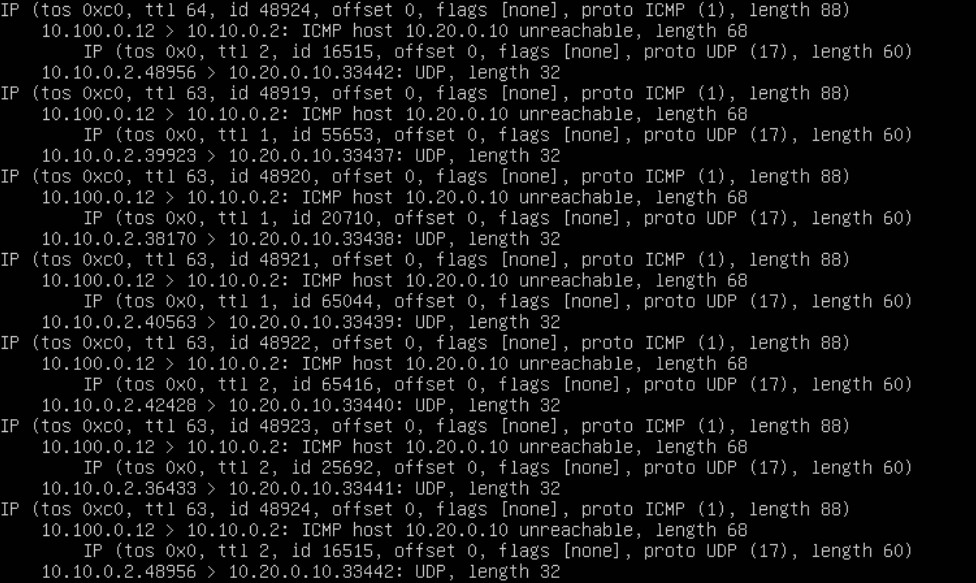
_Скриншот №5.5.1 Запуск `tcpdump` для перехвата сетевого трафика на r1_  
  
- При помощи утилиты **traceroute** построим список маршрутизаторов на пути от ws11 до ws21.  
- Выполним на ws11 команду: `traceroute 10.20.0.10`.  
  
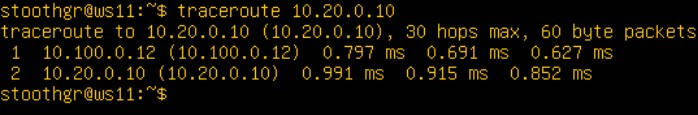
_Скриншот №5.5.2 Построенный `traceroute` список маршрутизаторов на пути от ws11 до ws21_  
  
Опираясь на вывод, полученный из дампа на r1, объясним принцип работы построения  
пути при помощи **traceroute**:  
  
 * Принцип работы traceroute основан на использовании поля TTL (Time To Live) в IP-пакетах,
что позволяет выявить все промежуточные узлы (хопы) на пути к цели.  
  
> **I.**  Отправка пакетов с увеличением TTL: Traceroute отправляет серию пакетов к целевому узлу,
   начиная с TTL, равного 1. Каждый раз, когда пакет проходит через маршрутизатор, его TTL 
   уменьшается на 1. Если TTL достигает нуля, маршрутизатор отбрасывает пакет и отправляет
   обратно сообщение ICMP "Time Exceeded" (время вышло) к отправителю.   

> **II.** Получение ответов от маршрутизаторов: Утилита фиксирует адрес маршрутизатора, который 
   отправил сообщение об ошибке, и время отклика. Затем traceroute повторяет процесс,
   увеличивая TTL на единицу для следующего пакета. Таким образом, второй пакет будет
   иметь TTL=2, третий — TTL=3 и так далее.  

> **III.** Завершение трассировки: Процесс продолжается до тех пор, пока пакет не достигнет конечного
   узла или не будет превышено максимальное количество хопов (обычно 30). Когда пакет достигает
   целевого узла, он не отбрасывается и может получить ответ от него, что завершает трассировку.  
  
### 5.6. Использование протокола ICMP при маршрутизации
  
- Запустим на r1 перехват сетевого трафика, проходящего через eth0 с помощью команды:  
`sudo tcpdump -n -i eth0 icmp`  
  
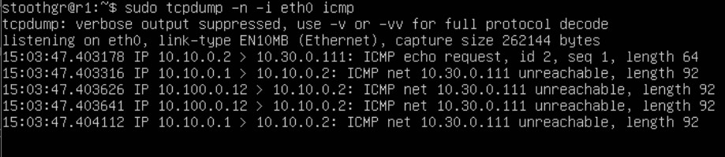
_Скриншот №5.6.1 Перехват сетевого трафика на r1_  
  
- Пропингуем с ws11 несуществующий IP (например, *10.30.0.111*) с помощью команды:  
  `ping -c 1 10.30.0.111`  
  
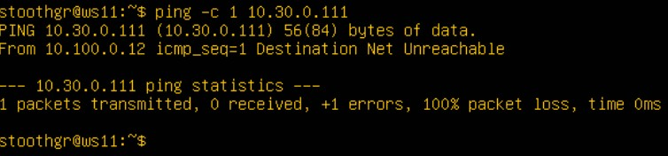  
_Скриншот №5.6.2 Пингуем с ws11 несуществующий IP_  
  
Сохраняем дампы образов виртуальных машин.  
  
## Part 6. Динамическая настройка IP с помощью DHCP  
   
### 6.1. Настройка службы DHCP на r2
   
- Для r2 настроим в файле */etc/dhcp/dhcpd.conf* конфигурацию службы **DHCP**:  
  
`sudo nano /etc/dhcp/dhcpd.conf` 
   
- 1) Укажем адрес маршрутизатора по умолчанию, DNS-сервер и адрес внутренней сети.
 
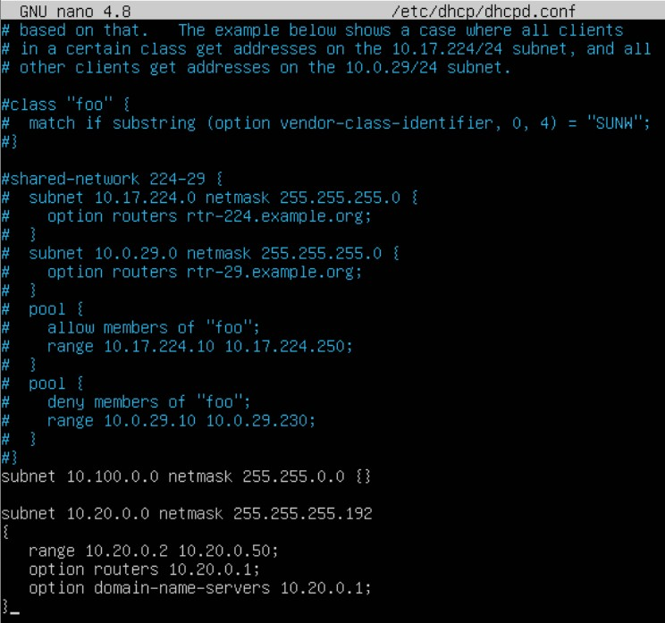  
_Скриншот №6.1.1 Конфигурация службы **DHCP** на r2_  
  
- 2) В файле `/etc/resolv.conf` (который содержит адреса серверов имен, к которым имеет доступ данная система) прописываем `nameserver 8.8.8.8`  

`sudo nano /etc/resolv.conf`  
  
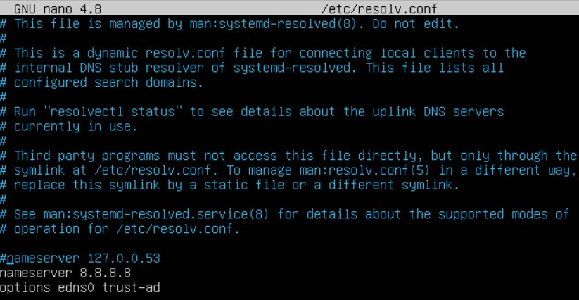  
_Скриншот №6.1.2 Адреса серверов имен на r2_  
  
- Перезагрузим службу DHCP на r2 командой `systemctl restart isc-dhcp-server`  
  
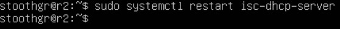  
_Скриншот №6.1.3 Перезагрузка службы DHCP на r2_  
  
Изменим настройки машины `ws21` в файле конфигурации, чтобы сделать протокол DHCP активным и автоматически выдающим адрес.  
  
`sudo nano /etc/netplan/00-installer-config.yaml`  
  
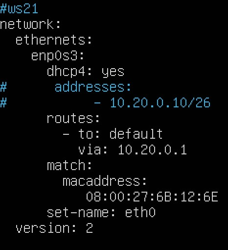  
_Скриншот №6.1.4 Перенастройка ws21 на получение динамического ip_  
  
И применим изменения на ws21 командой: `sudo netplan apply`  
  
-  Машину ws21 перезагружаем при помощи `reboot` и через `ip a` убеждаемся, что она получила адрес.
Также пропингуем ws22 с ws21, командой `ping 10.20.0.20 -c 4`
  
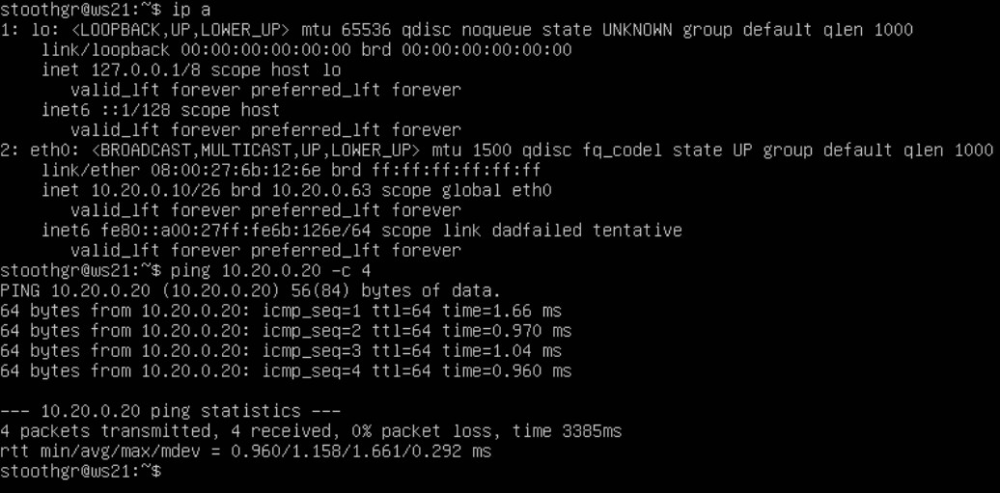  
_Скриншот №6.1.5 Полученный ws21 адрес, и пингуем ws22 с ws21_  
  
### 6.2. Настройка службы DHCP на r2, с жесткой привязкой к MAC-адресу (ws11)

- Выключив ws11 меняем для этой машины в VirtualBox, настройки сетевого адаптера: назначаем новый  MAC-адрес `10:10:10:10:10:BA`, запускаем машину.  
  
- Указываем MAC-адрес у ws11, для этого в *etc/netplan/00-installer-config.yaml* добавляем строки: `macaddress: 10:10:10:10:10:BA`, `dhcp4: true`.
  
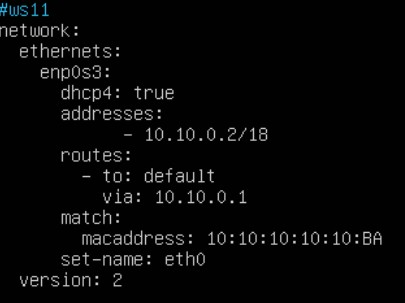  
_Скриншот №6.2.1 Включение DHCP и новый  MAC-адрес `10:10:10:10:10:BA` на ws11_  
  
- Для r1 настраиваем конфигурацию службы DHCP аналогично r2, но сделаем выдачу адресов с жесткой привязкой к MAC-адресу (ws11).    
-  Так же, после завершения и принятия настроек, проводим аналогичные тесты.  
  
Редактируем: `sudo nano /etc/dhcp/dhcpd.conf` на r1  
  
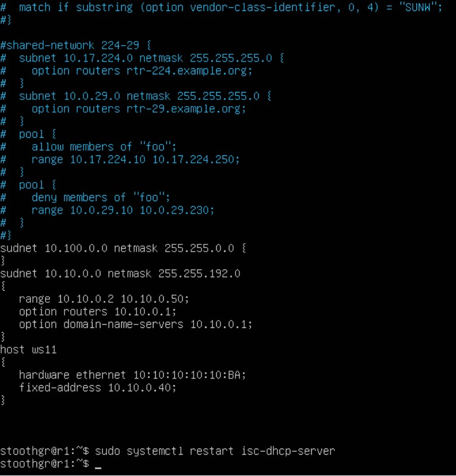  
_Скриншот №6.2.2 Конфигурация службы **DHCP** на r1_ 
  
Аналогично тому как мы делали на r2, редактируем на r1 адреса серверов имён командой:  
`sudo nano /etc/resolv.conf`   
  
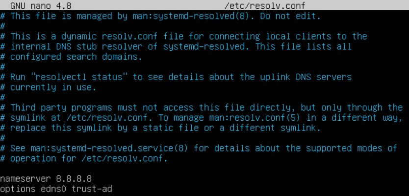  
_Скриншот №6.2.3 Адреса серверов имен на r1_  
  
- Перезагрузим службу DHCP на r1 командой `systemctl restart isc-dhcp-server`  
  
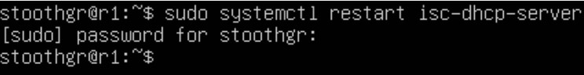  
_Скриншот №6.2.4 Перезагрузка службы DHCP на r1_  
   
Применим изменения на ws11 командой: `sudo netplan apply`  
  
-  Машину ws11 перезагружаем при помощи `reboot` и через `ip a` убеждаемся, что она получила IP адрес, с жесткой привязкой к MAC-адресу.  
Также пропингуем ws22 с ws11, командой `ping 10.20.0.20 -c 4`
  
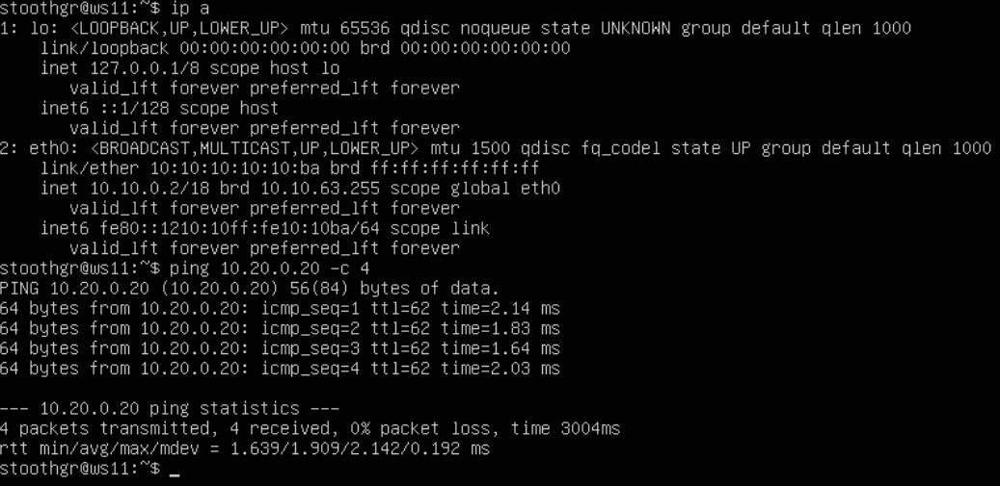  
_Скриншот №6.2.5 Выводим на экран полученный ws11 адрес, с жесткой привязкой к MAC-адресу, а так же  пингуем ws22 с ws11_  
  
### 6.3. Обновление ip адреса с помощью команды sudo dhclient  
  
- Запросим с ws21 обновление IP-адреса.  
  
- Проверяем IP `ws21` до обновления `ip a`  
  
- Для обновления ip адреса, используем команду `sudo dhclient -r`, которая освободит ip-адрес, затем команду `sudo dhclient`, которая отправит запрос на получение нового адреса у DHCP сервера.  
  
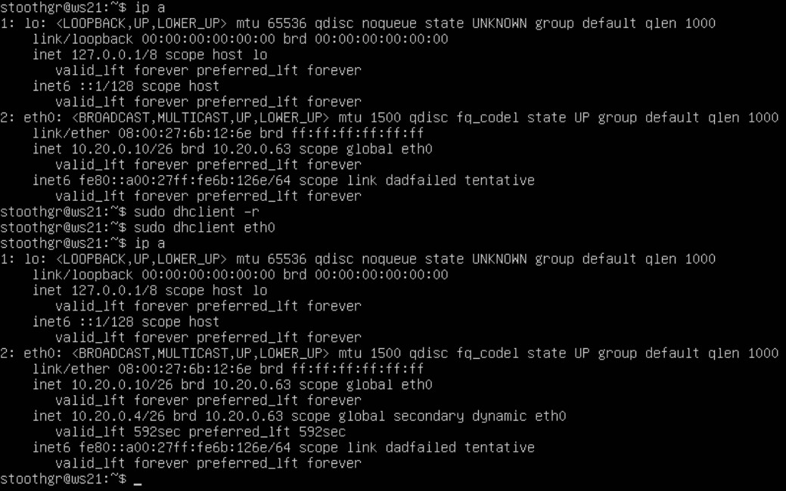  
_Скриншот №6.3 Обновление ip адреса на ws21_  
  
* Для настройки `DHCP` используються следующие опции:  
  
- 1. `subnet`: определяет адресное пространство подсети и маску подсети.
- 2. `range`: определяет диапазон IP-адресов, которые DHCP-сервер может назначать клиентам.
- 3. `option routers`: определяет адрес шлюза по умолчанию для клиентов в этой подсети.
- 4. `option domain-name-servers`: определяет адреса DNS-серверов, которые будут использоваться клиентами.
- 5. `host`: позволяет назначить опции для конкретного хоста по его MAC-адресу.  
  
На скриншоте мы видим, сначала выведенный командой `ip a` старый адрес, затем команда `ip a` выводит результат работы команды `dhclient -r`, освобождающий текущий `ip` адрес.  
И мы видим что, машине больше не назначен `ip` адрес.  
Затем выполняеться `sudo dhclient eth0`, чтобы запросить новый `ip` адрес для интерфейса `eth0`, и  командой `ip a` выводим на экран новый адрес.
  
- Сохраняем дампы образов виртуальных машин.
  
[🔼вернуться к содержанию](#содержание)  
  
## Part 7. NAT 
  
> **SNAT и DNAT**  
  
> **NAT** — это аббревиатура (Network Address Translation) для преобразования сетевых адресов.
[NAT](https://habr.com/ru/post/583172/ "NAT (Network Address Translation) для новичков") возникает при изменении одного из IP-адресов в заголовке IP-пакета, т. е. IP-адреса источника (source-addr) или IP-адреса назначения (dest-addr).

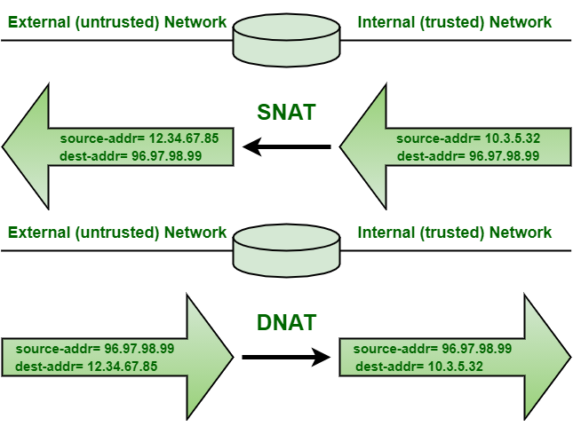

ПАРАМЕТР| **SNАТ**| **DNAT**
---------|----------|-----------
Аббревиатура |источник **NAT**|назначение **NAT**
Терминология|**SNAT** изменяет частный IP-адрес исходного хоста на общедоступный IP-адрес. Он также может изменить исходный порт в заголовках TCP/UDP. **SNAT** обычно используется внутренними пользователями для доступа в Интернет. |Назначение **NAT** изменяет адрес назначения в IP-заголовке пакета. Он также может изменить порт назначения в заголовках TCP/UDP. **DNAT** используется, когда нам нужно перенаправить входящие пакеты с общедоступным адресом/портом на частный IP-адрес/порт внутри внутренней сети.
Пример использования |Клиент внутри локальной сети и за брандмауэром хотел просматривать Интернет|Веб-сайт, размещенный в центре обработки данных за брандмауэром, и должен быть доступен для пользователей через Интернет
Изменение адреса|**SNAT** изменяет адрес источника пакетов, проходящих через устройство **NAT**|**DNAT** изменяет адрес назначения пакетов, проходящих через маршрутизатор.
Порядок работы|**SNAT** выполняется после принятия решения о маршрутизации.|**DNAT** выполняется до принятия решения о маршрутизации.
Коммуникационный поток|Когда внутренняя защищённая сеть инициирует связь с внешним миром, происходит **SNAT**|Когда внешняя незащищенная сеть инициирует связь с внутренней защищенной сетью, происходит **DNAT**.
Один/несколько хостов|**SNAT** позволяет использовать несколько хостов во «внутренней» сети для доступа к любому хосту во «внешней» сети|**DNAT** позволяет любому хосту во «внешней» сети получить доступ к одному хосту во «внутренней» сети

> **Apache 2**, или **Apache HTTP Server**, — это широко используемое программное обеспечение для веб-сервера с открытым исходным кодом, разработанное Apache Software Foundation. Оно предназначено для обслуживания веб-страниц и другого контента в Интернете и поддерживает различные операционные системы, включая Linux, Windows и macOS
  
Для работы с сервером `apache2`, если мы не установили его ранее, то выполним установку на машины `r1`, `r2` и `ws22`.  
`sudo apt install apache2`  
(Для установки, потребуеться подключить доступ в интернет.)  
    
### 7.1 Делаем сервер Apache2 общедоступным
  
- В файле */etc/apache2/ports.conf* на ws22 и r1 изменим строку `Listen 80` на `Listen 0.0.0.0:80`, то есть сделаем сервер Apache2 общедоступным.  
  
`sudo nano /etc/apache2/ports.conf`  
  
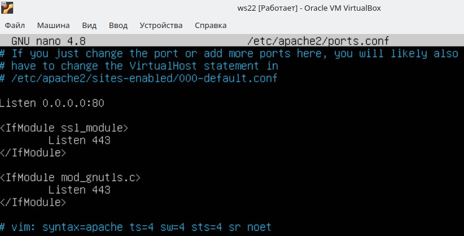  
_Скриншот №7.1.1 Сделаем сервер Apache2 общедоступным на r1_  
  
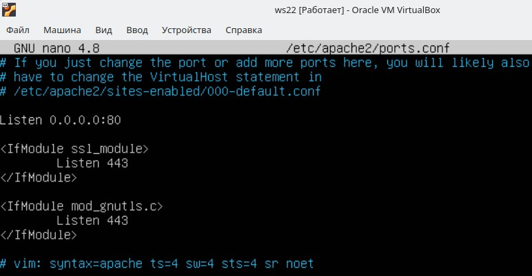  
_Скриншот №7.1.2 Сделаем сервер Apache2 общедоступным на ws22_  
  
Запустим сервер `Apache` на `ws22` и `r1`
  
`sudo service apache2 start`  
  
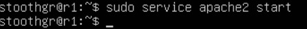  
_Скриншот №7.1.3 Старт сервера Apache2 на r1_  
  
  
_Скриншот №7.1.2 Старт сервера Apache2 на ws22_  
  
### 7.2 Создаем фаервол на r2 [(как в части 4)](#41-утилита-iptables)  
  
- Добавляем в фаервол, созданный по аналогии с фаерволом из Части 4, на r2 следующие правила:
- 1) Удаление правил в таблице filter — `iptables -F`;
- 2) Удаление правил в таблице «NAT» — `iptables -F -t nat`;
- 3) Отбрасывать все маршрутизируемые пакеты — `iptables --policy FORWARD DROP`.
  
  
_Скриншот №7.2.1 Файл имитирующий файрвол /etc/firewall.sh на r2_
  
- Запускаем файл также, как в Части 4.  
Для запуска: `firewall.sh` на `r2`, выполним:  
`sudo chmod +x /etc/firewall.sh`  
`sudo bash /etc/firewall.sh`  
  
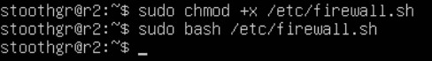  
_Скриншот №7.2.2 Запуск файрвола на r2_  
  
- Проверяем соединение между ws22 и r1 командой `ping`.
*При запуске файла `firewall.sh` с этими правилами, ws22 не должна «пинговаться» с r1.*
  
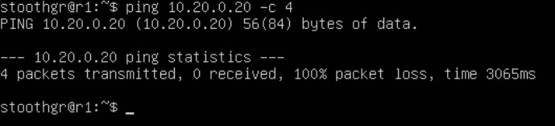  
_Скриншот №7.2.3 Машина ws22 не пингуеться с r1, так как файрвол отбрасывает 
все маршрутизируемые пакеты_  
  
- Добавим в файл ещё одно правило:
- 4) Разрешить маршрутизацию всех пакетов протокола **ICMP**.
Для этого прописываем его для протокола icmp и цепочки FORWARD: `iptables -A FORWARD -p icmp -j ACCEPT`  
  
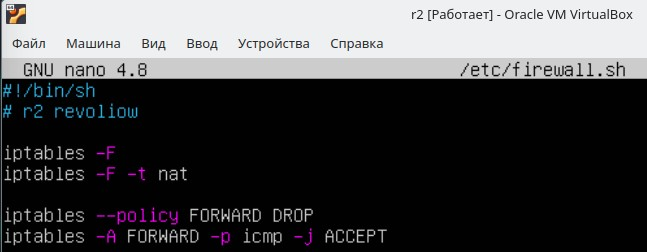  
_Скриншот №7.2.4 Изменённый файл, имитирующий файрвол /etc/firewall.sh на r2_ 

- Запустим файл также, как в Части 4.
  
Снова запустим `firewall.sh` на  r2:   
`sudo chmod +x /etc/firewall.sh`   
`sudo bash /etc/firewall.sh`  
  
- Проверим соединение между ws22 и r1 командой `ping`.
*При запуске файла с этими правилами, ws22 должна «пинговаться» с r1.*

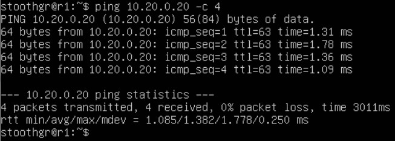  
_Скриншот №7.2.5 Машина ws22 успешно пингуеться с r1_  
  
- Добавим в файл ещё два правила:
- 5) Включим **SNAT**, а именно маскирование всех локальных IP из локальной сети, 
находящейся за r2 (по обозначениям из Части 5 — сеть 10.20.0.0).
- 6) Включим **DNAT** на 8080 порт машины r2 и добавим к веб-серверу Apache, 
запущенному на ws22, доступ извне сети.
  
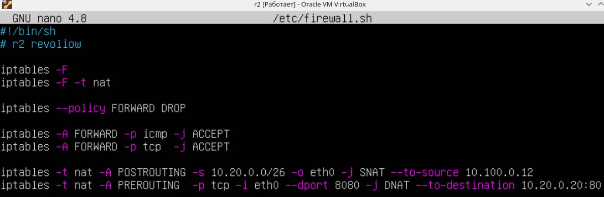  
_Скриншот №7.2.6 Добавление SNAT и DNAT в `firewall.sh` на r2_ 
  
- Снова запустим `firewall.sh` на r2  
`sudo chmod +x /etc/firewall.sh`   
`sudo bash /etc/firewall.sh`  
  
- Проверим соединение по TCP для **SNAT**: для этого с ws22 подключаемся к серверу Apache на r1 командой:
`telnet [адрес] [порт]`    
  
Выполняем на ws22: `telnet 10.100.0.11 80`  
  
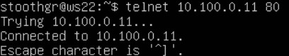  
_Скриншот №7.2.5 Результат ввывода команды `telnet 10.100.0.11 80` на ws22:_  
  
- Проверяем соединение по TCP для **DNAT**: для этого с r1 подключаемся к серверу Apache на ws22 командой `telnet` (обращаться по адресу r2 и порту 8080).
  
Выполняем на r1: `telnet 10.100.0.12 8080`

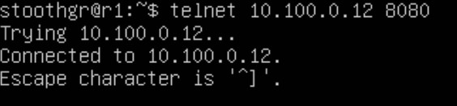  
_Скриншот №7.2.8 Результат ввывода команды ``telnet 10.100.0.12 8080` на r1:_  
  
Сохраняем дампы образов виртуальных машин  
    
**Команды которые мы использовали для работы с NAT:**

- Очистка всех правил

  > iptables -F

  Эта команда очищает все существующие правила во всех цепочках.

- Удаление пользовательских цепочек

  > iptables -X

  Эта команда удаляет любые пользовательские цепочки, которые не используются.

- Очистка правил в таблице NAT

  > iptables -F -t nat

  Эта команда очищает все правила в таблице NAT (Сетевой адресный перевод), которая используется для изменения пакетов при создании новых соединений.

- Установка политики по умолчанию для цепочки FORWARD

  > iptables -P FORWARD DROP

  Эта команда устанавливает политику по умолчанию для цепочки FORWARD на DROP, что означает, что все пересылаемые пакеты будут блокироваться, если не будут явно разрешены последующими правилами.

- Разрешение ICMP-трафика

  > iptables -A FORWARD -p icmp -j ACCEPT

  Эта команда разрешает пересылку ICMP-пакетов (используемых для ping и других сетевых утилит).

- Разрешение HTTP-трафика

  > iptables -A FORWARD -p tcp --dport 80 -j ACCEPT

  Эта команда разрешает пересылку TCP-трафика на порт 80 (HTTP).

- Разрешение установленных соединений

  > iptables -A FORWARD -m state --state ESTABLISHED -j ACCEPT
Используем Local TCP forwarding с `ws21` до `ws22`, чтобы получить доступ к веб-серверу на `ws22` с `ws21`
  Это правило разрешает пересылку пакетов, которые являются частью установленного соединения или связаны с ним.

- Разрешение трафика между конкретными интерфейсами

  > iptables -A FORWARD -i enp0s9 -o enp0s8 -j ACCEPT

  Эта команда разрешает пересылку пакетов с интерфейса enp0s9 на enp0s8.

- Правило SNAT для исходящего трафика

  > iptables -t nat -A POSTROUTING -o enp0s8 -s 10.20.0.0/26 -j SNAT --to-source 10.100.0.12

  Эта команда изменяет адрес источника исходящих пакетов из указанной подсети так, чтобы они выглядели так, будто исходят от 10.100.0.12.

- Правило DNAT для входящего трафика

  > iptables -t nat -A PREROUTING -i enp0s8 -p tcp --dport 8080 -j DNAT --to-destination 10.20.0.20:80

  Эта команда перенаправляет все входящие TCP-пакеты на порт 8080 интерфейса `enp0s8` к внутреннему серверу с IP-адресом 10.20.0.20, который слушает на порту 80.

**Значения использованных опций:**

> - `t` - указывает на используемую таблицу;
> - `p` - указывает протокол, такие как tcp, udp, udplite и другие, поддерживаемые системой, ознакомиться со списком можно в файле `/etc/protocols`;
> - `m` - подключает указанный модуль;
> - `s` - указывает адрес источника пакета, в качестве значения можно указать как один IP-адрес, так и диапазон;
> - `i` - задает входящий сетевой интерфейс;
> - `o` - указывает исходящий сетевой интерфейс;
> - `--dport` - порт получателя пакета;
> - `DNAT` — подменяет адрес получателя в заголовке IP-пакета, основное применение — предоставление доступа к сервисам снаружи, находящимся внутри сети;
> - `SNAT` — служит для преобразования сетевых адресов, применимо, когда за сервером находятся машины, которым необходимо предоставить доступ в Интернет, при этом от провайдера имеется статический IP-адрес.
  
[🔼вернуться к содержанию](#содержание)  
  
## Part 8. Дополнительно. Знакомство с SSH Tunnels
  
- Запустим на r2 фаервол с правилами из Части 7.  
`sudo chmod +x /etc/firewall.sh`   
`sudo bash /etc/firewall.sh`  
  
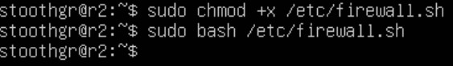  
_Скриншот №8.1.1 Запуск файрвола на r2_  

- Запускаем веб-сервер Apache на `ws22` только на localhost (то есть в файле `/etc/apache2/ports.conf` изменим строку `Listen 80` на `Listen localhost:80`)  
  
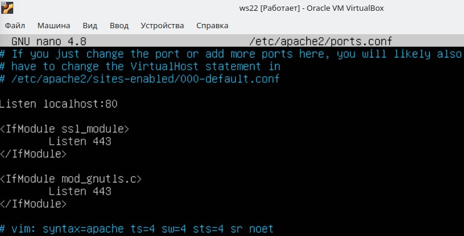  
_Скриншот №8.1.2 Сделаем сервер Apache2 не общедоступным на ws22_  
  
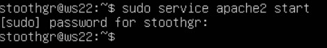  
_Скриншот №8.1.3 Выполним рестарт сервера Apache2 на ws22_  
  
- Воспользуемся *Local TCP forwarding* с ws21 до ws22, чтобы получить доступ к веб-серверу на ws22 с ws21.  
  
> sh -L [локальный_адрес:]локальный_порт:удаленный_адрес:удаленный_порт [пользователь@]сервер.   
  
> Переадресация локального порта позволяет перенаправить порт на локальном компьютере (клиент ssh) на порт на удаленном компьютере (сервер ssh), который затем перенаправляется на порт на компьютере назначения.
В этом типе переадресации клиент SSH прослушивает заданный порт и туннелирует любое подключение к этому порту к указанному порту на удаленном сервере SSH, который затем подключается к порту на целевом компьютере. Конечным компьютером может быть удаленный SSH-сервер или любой другой компьютер.  
  
Выполняем на ws21:  
`ssh -L 8080:127.0.0.1:80 10.20.0.20 -p 2022`  
  
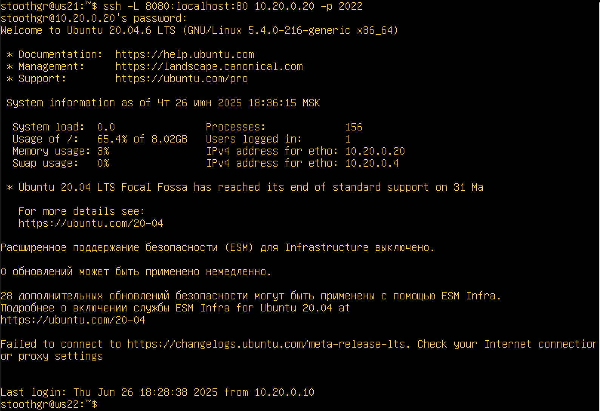  
_Скриншот №8.1.4 Подключение к ws22 с ws21 с помощью команды: `ssh -L 8080:127.0.0.1:80 10.20.0.20 -p 2022`_   
  
- Воспользуемся *Remote TCP forwarding* c ws11 до ws22, чтобы получить доступ к веб-серверу на ws22 с ws11.  
  
> Переадресация удаленного порта противоположна переадресации локального порта. Это позволяет перенаправить порт на удалённом компьютере (сервер ssh) на порт на локальном компьютере (клиент ssh), который затем перенаправляется на порт на компьютере назначения.
В этом типе переадресации сервер SSH прослушивает заданный порт и туннелирует любое соединение с этим портом на указанный порт локального клиента SSH, который затем подключается к порту на целевом компьютере. Машина назначения может быть локальной или любой другой машиной. Удаленное перенаправление портов в основном используется для предоставления доступа к внутренней службе кому-то извне.

Из-за того что на роутере `r2` настроен firewall, подключиться к серверу Apache на машине `ws22` с помощью команды `ssh -L`, с машины `ws11`, не получится (роутер `r2` не пропустит команду). В этом случае необходимо воспользоваться командой `ssh -R`. Выполнить её необходимо на машине `ws22`. Это выполняется за несколько шагов:

- На машине `ws11`: переход с машины `ws11` на роутер `r2` с помощью `ssh` (роутер не позволит сразу перейти на машину `ws22`);
- На машине `ws11`: переход с роутера `r2` на машину `ws22` с помощью `ssh`;
- На машине `ws11`: проброс туннеля с машины `ws22` на машину `ws11` с помощью `ssh -R`;  
  
Описание команды:  
  
`ssh -R [удаленный_адрес:]удаленный_порт:локальный_адрес:локальный_порт [пользователь@]сервер`
  
`ssh -R 8080:127.0.0.1:80 10.20.0.20 -p 2022`  
   
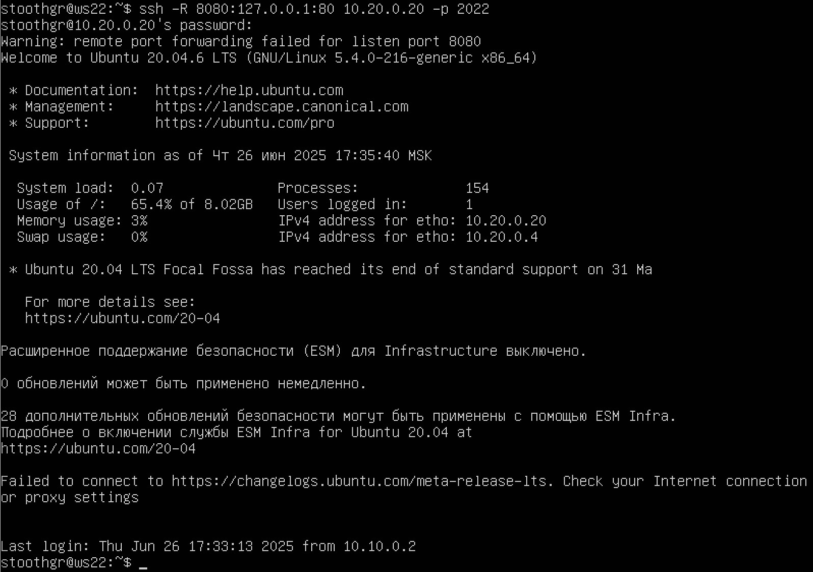  
_Скриншот №8.1.5 Подключение к ws22 с ws21 с помощью команды: `ssh -R 8080:127.0.0.1:80 10.20.0.20 -p 2022`_ 
  
- Для проверки, сработало ли подключение в обоих предыдущих пунктах, перейдём во второй терминал (например, клавишами Alt + F2) и выполним команду:  
`telnet 127.0.0.1 [локальный порт]`  
  
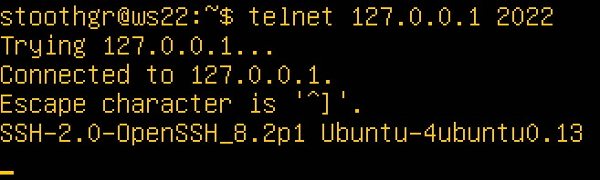   
_Скриншот №8.1.6 Проверка подключения на ws21_  
  
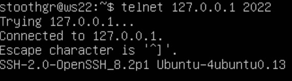   
_Скриншот №8.1.7 Проверка подключения на ws11_  
  
Сохраняем дампы образов виртуальных машин  
  
[🔼вернуться к содержанию](#содержание)

